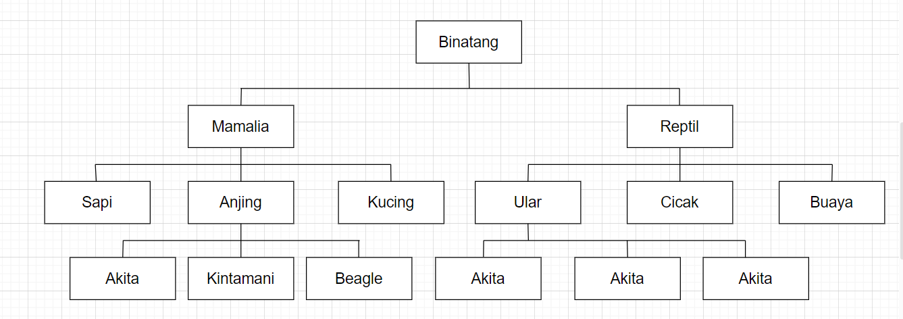
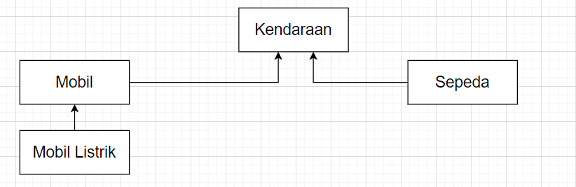

# Tugas Teori

Nama : Chyntia Santi Nur Trisnawati  
Kekas : 2C  
Absen : 08 (Delapan)  
NIM : 2241720017

## Soal

1. Carilah sebuah studi kasus dari hierarchical dan hybrid
   inheritance, kemudian gambarkan UML class diagramnya.  
   Jawab :  
   a. Hierarchical  
   masing-masing kelas anak ini akan menurunkan lagi kelas anak di bawahnya. yaitu kelas Reptil akan menurunkan kelas Buaya , Ular dan Ciak. kelas Mamalia akan menurunkan kelas Anjing, Kucing, Sapi, Pada subkelas itu nanitnnya akan diturunkan lagi
   
   b. Hybird Inheritance  
   Buatlah sebuah Class Kendaraan yang memiliki dua subclass yaitu Mobil dan Motor. Mobil juga memiliki turunan yaitu mobil listrik  
   
