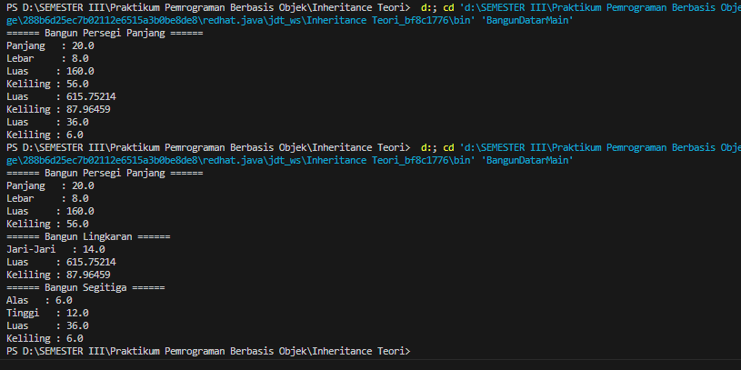

# Inheritance Teori
Nama : Chyntia Santi Nur Trisnawati             
Kelas : 2C             
Absen : 08 (Delapann)          
NIM : 2241720017

## SOAL
1. Tuliskan program yang berfungsi untuk menghitung luas dan keliling bangun datar.

Jawab :    
Class BangunDatar
```java
public class BangunDatar{
    private float luas;
    private float keliling;

    public BangunDatar(){

    }

    public float hitungLuas(){
        return 0;
    }

    public float hitungKeliling() {
        return 0;
    }
    public void cetakHasil(){
        System.out.println("Luas     : " + hitungLuas());
        System.out.println("Keliling : " +hitungKeliling());
    }
}
```
Class PersegiPanjang
```java
public class PersegiPanjang extends BangunDatar {
    private float panjang;
    private float lebar;

    public PersegiPanjang(){

    }

    public PersegiPanjang(float panjang, float lebar){
        this.panjang = panjang;
        this.lebar = lebar;
    }

    public float hitungLuas() {
        return panjang * lebar;
    }

    public float hitungKeliling() {
        return 2 * (panjang + lebar);
    }

    public void CetakPP(){
        System.out.println("====== Bangun Persegi Panjang ====== ");
        System.out.println("Panjang   : " + panjang);
        System.out.println("Lebar     : "+ lebar);
        cetakHasil();

    }
}
```
Class Lingkarang
```java
import java.security.PublicKey;

import javax.swing.plaf.synth.SynthLookAndFeel;

public class Lingkaran extends BangunDatar{
    private float r;

    public Lingkaran(float r) {
        this.r = r;
    }

    public float hitungLuas() {
        return (float) (Math.PI * r * r);

    }

    public float hitungKeliling() {
        return (float) (2 * Math.PI * r);
    }

    public void cetakL(){
        System.out.println("====== Bangun Lingkaran ====== ");
        System.out.println("Jari-Jari   : " + r);
        cetakHasil();
    }
}
```
Class Segitiga
```java
public class Segitiga extends BangunDatar {
    private float tinggi;
    private float alas;
    private float sisi1;
    private float sisi2;

    public Segitiga(){

    }

    public Segitiga(float tinggi, float alas){
        this.tinggi = tinggi;
        this.alas = alas;
    }

    public float hitungLuas(){
        return 0.5f * alas * tinggi;
    }

    public float hitungKeliling(){
        return alas + sisi1 + sisi2;
    }

    public void cetakSet(){
        System.out.println("====== Bangun Segitiga ====== ");
        System.out.println("Alas   : " + alas );
        System.out.println("Tinggi   : " + tinggi );
        cetakHasil();
    }
}
```
Class BangunDatarMain
```java
public class BangunDatarMain {
    public static void main(String[] args) {
        PersegiPanjang PP = new PersegiPanjang(20 , 8);
        PP.CetakPP();

        Lingkaran L = new Lingkaran(14);
        L.cetakL();

        Segitiga S = new Segitiga(12, 6);
        S.cetakSet();
    }
}
```
Hasil ketika dijalankan adalah sebagai berikut
