# Laporan Pemrograman Berbasis Objek 
# PERTEMUAN 3
## Disusun Oleh :
Nama        : Chyntia Santi Nur Trisnawati

Absen       : 08 (Delapan)

Kelas       : 2C

NIM         : 2241720017

# 4. Percobaan

## 4.1 Percobaan 1: Membuat Class Diagram
Studi Kasus 1:

Dalam suatu perusahaan salah satu data yang diolah adalah data karyawan. Setiap
karyawan memiliki id, nama, jenis kelamin, jabatan, jabatan, dan gaji. Setiap mahasiswa
juga bisa menampilkan data diri pribadi dan melihat gajinya.
1. Gambarkan desain class diagram dari studi kasus 1!,

``Jawab``

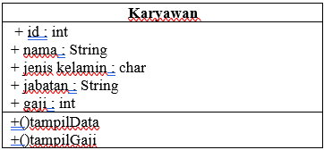


2. Sebutkan Class apa saja yang bisa dibuat dari studi kasus 1!,

``Jawab``

Class yang bisa dibuat adalah

a.	Karyawan                                                                                       
b.	Gaji

3. Sebutkan atribut beserta tipe datanya yang dapat diidentifikasi dari masing-masing
class dari studi kasus 1!

``Jawab``

a.	Id	 	    : int                                                          
b.	Nama	    : String                                                               
c.	Jenis Kelamin : char
d.	Jabatan	    : String
e.	Gaji	    : int

4. Sebutkan method-method yang sudah anda buat dari masing-masing class pada studi
kasus 1!

``Jawab``

a.	tampilData                                                                             
b.	tampilGaji

## 4.2	Percobaan 2: Membuat dan mengakses anggota suatu class

Studi Kasus 2:                     
Perhatikan class diagram dibawah ini. Buatlah program berdasarkan class diagram tersebut

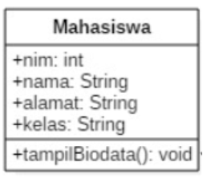

Langkah kerja:
1. Bukalah text editor atau IDE, misalnya Notepad ++ / netbeans.
2. Ketikkan kode program berikut ini:

```java
public class mahasiswa{
    public int nim;
    public String nama;
    public String alamat;
    public String kelas;

    public void tampilBiodata(){
        System.out.println("Nim     : " +nim);
        System.out.println("Nama    : " +nama);
        System.out.println("Alamat  : " +alamat);
        System.out.println("Kelas   : " +kelas);
    }
}
```

3. Simpan dengan nama file Mahasiswa.java.
4. Untuk dapat mengakses anggota-anggota dari suatu obyek, maka harus dibuat instance
dari class tersebut terlebih dahulu. Berikut ini adalah cara pengaksesan anggotaanggota dari class Mahasiswa dengan membuka file baru kemudian ketikkan kode
program berikut:
```java
public class testMahasiswa {
    public static void main(String[] args) {
        mahasiswa mhs1 = new mahasiswa();
        mhs1.nim = 101;
        mhs1.nama = "Lestari";
        mhs1.alamat = "Jl. Vinolia No 1A";
        mhs1.kelas = "1A";
        mhs1.tampilBiodata();
    }
}
```

5. Simpan file dengan TestMahasiswa.java
6. Jalankan class TestMahasiswa
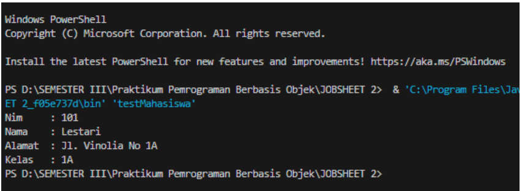

7. Jelaskan pada bagian mana proses pendeklarasian atribut pada program diatas!

``Jawab``

Proses pendeklarasian atribut pada program tersebut yaitu terjadi pada class mahasiswa yaitu
dengan tipe data yang sesuai. Menggunakan “public” untuk dapat di akses di semua kelas.
Pendeklarasian dilakukan satu persatu sesuai dengan tipe data pada atribut.

8. Jelaskan pada bagian mana proses pendeklarasian method pada program diatas!

``Jawab``

Untuk mendeklarasikan method perlu dilakukan inisialisasi. Pada program di atas instansiasi
terjadi pada kode program “mahasiswa mh1 = new mahasiswa();”
Kemudian dapat memanggil method sesuai nama yang diinginkan. Dan akan secara otomatis akan
dijalankan di main.

9. Berapa banyak objek yang di instansiasi pada program diatas!

``Jawab``

Hanya ada satu yaitu pada kode program mahasiswa mhs1 = new mahasiswa;

10. Apakah yang sebenarnya dilakukan pada sintaks program “mhs1.nim=101” ?

``Jawab``

Sintaks program tersebut untuk menyimpan nim, sehingga Ketika nim di panggil di kelas lain
maka secara otomatis akan diisi 101 sesuai yang disimpan.

11. Apakah yang sebenarnya dilakukan pada sintaks program “mhs1.tampilBiodata()” ?

``Jawab``

Sintaks program tersebut untuk memanggil method sehingga tidak perlu dilakukan penulisan
dengan isian yang sama, sehingga cukup memanggil method maka tampilan biodata sudah dapat
dilihat secara keseluruhan.

12. Instansiasi 2 objek lagi pada program diatas!

``Jawab``

```java
public class testMahasiswa {
    public static void main(String[] args) {
        mahasiswa mhs1 = new mahasiswa();
        mhs1.nim = 101;
        mhs1.nama = "Lestari";
        mhs1.alamat = "Jl. Vinolia No 1A";
        mhs1.kelas = "1A";
        mhs1.tampilBiodata();

        System.out.println(" ");

        mahasiswa mhs2 = new mahasiswa();
        mhs2.nim = 102;
        mhs2.nama = "Reyhan";
        mhs2.alamat = "Jl. Mekar Jaya No 1A";
        mhs2.kelas = "1A";
        mhs2.tampilBiodata();
        ;

    }
}
```

Tampilan Ketika dijalankan

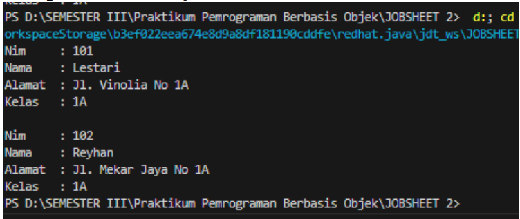

## 4.3 Percobaan 3: Menulis method yang memiliki argument/parameter dan memiliki return

Gambaran Class Diagram

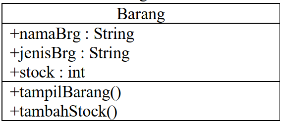

Langkah kerja:
1. Bukalah text editor atau IDE, misalnya Notepad ++ / netbeans.
2. Ketikkan kode program berikut ini:
```java
public class barang {
    public String namaBrg;
    public String jenisBrg;
    public int stock;

    public void tampilBarang(){
        System.out.println("Nama Barang   : " +namaBrg);
        System.out.println("Jenis Barang  : " +jenisBrg);
        System.out.println("Stok          : " +stock);
    }

    //Method dengan argumen dan nilai batik (return)
    public int tambahStock(int brgMasuk) {
        int stockBaru = brgMasuk+stock;
        return stockBaru;
    }
}
```

3. Simpan dengan nama file Barang.java
4. Untuk dapat mengakses anggota-anggota dari suatu obyek, maka harus dibuat instance
dari class tersebut terlebih dahulu. Berikut ini adalah cara pengaksesan anggotaanggota dari class Barang dengan membuka file baru kemudian ketikkan kode program
berikut:

```java
public class testBarang {
    public static void main(String[] args) {
        barang brg1 = new barang();
        brg1.namaBrg = "Pensil";
        brg1.jenisBrg = "ATK";
        brg1.stock = 10;
        brg1.tampilBarang();

        // menampilkan dan mengisi argumen untuk menambahkan stok barang
        System.out.println("Stok Baru adalah " + brg1.tambahStock(20));
    }
}
```

5. Simpan dengan nama file TestBarang.java
6. Jalankan program tersebut!
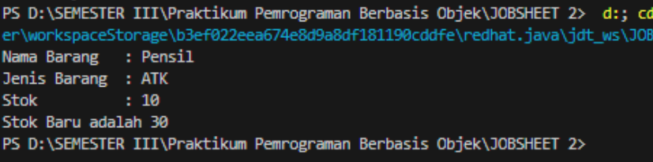

7. Apakah fungsi argumen dalam suatu method?

``Jawab``

Kegunaan Argumen didalam sebuah fungsi ialah memberikan nilai yang harus dieksekusi
dalam fungsi tersebut.

8. Ambil kesimpulan tentang kegunaan dari kata kunci return , dan kapan suatu method harus
memiliki return!

``Jawab``

Kata kunci return digunakan Ketika terdapat pengembalian dari suatu program seperti adanya
suatu penambahan dalam jumlah (melihat dari kasus tersebut) sehingga dibutuhkan hasil
keseluruhan. Untuk mempermudah jika ada banyaknya data maka return sangat cocok di
lakukan.

## 4.4 Tugas
1. Suatu toko persewaan video game salah satu yang diolah adalah peminjaman, dimana
data yang dicatat ketika ada orang yang melakukan peminjaman adalah id, nama member,
nama game, dan harga yang harus dibayar. Setiap peminjaman bisa menampilkan data hasil
peminjaman dan harga yang harus dibayar. Buatlah class diagram pada studi kasus diatas!
Penjelasan:
- Harga yang harus dibayar diperoleh dari lama sewa x harga.
- Diasumsikan 1x transaksi peminjaman game yang dipinjam hanya 1 game saja.
2. Buatlah program dari class diagram yang sudah anda buat di no 1!

``Jawab``

Class Diagram
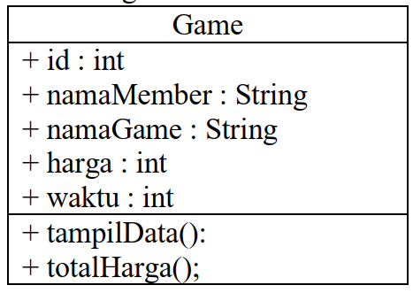

Kode Program Game
```java
public class game {
    public int id;
    public String namaMember;
    public String namaGame;
    public int harga;
    public int waktu;

    public void totalHarga(){
        int total = harga*waktu;
        System.out.println("Total yang harus dibayarkan : ");
    }

    public void tampilData(){
        System.out.println("ID            : " +id);
        System.out.println("Nama Member   : " +namaMember);
        System.out.println("Nama Game     : " +namaGame);
        System.out.println("Harga         : " +harga);
        System.out.println("Waktu         : " +waktu + " jam");
        
    }
}
```

Class Kode Main
```java
public class gameMain {
    public static void main(String[] args) {
        game gm = new game();
        gm.id = 1001;
        gm.namaMember = "Dhea";
        gm.namaGame = "Masak-Masak";
        gm.waktu = 2;
        gm.harga = 15000;
        gm.tampilData();
        gm.totalHarga();
    }
}
```

Program ketika dijalankan
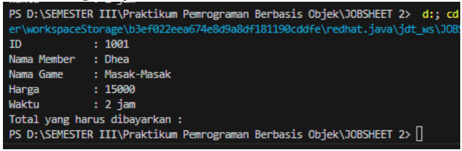

3. Buatlah program sesuai dengan class diagram berikut ini


Kode Program Class Lingkaran

```java
public class lingkaran {
    public double phi;
    public double r;

    public void hitungLuas() {
        double luasLingkaran = phi * r * r;
        System.out.println("Luas        :" + luasLingkaran);
    }

    public void hitungKeliling() {
        double kelilingLingkaran = phi * 2 * r * r;
        System.out.println("Keliling    :" + kelilingLingkaran);
    }

    public void tampil() {
        System.out.println("Phi         : " + phi);
        System.out.println("Jari-Jari   : " + r);

    }
}
```
Kode Program Class Lingkaran Main

```java
public class lingkaranMain {
    public static void main(String[] args) {
        lingkaran lr = new lingkaran();
        lr.phi = 3.16;
        lr.r = 100;
        lr.tampil();
        lr.hitungKeliling();
        lr.hitungLuas();
    }
}
```

Program Ketika dijalankan

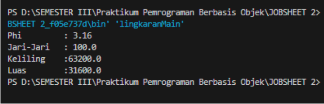

4. Buatlah program sesuai dengan class diagram berikut ini:

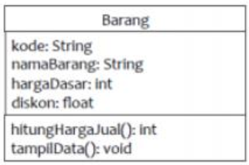

Deskripsi / Penjelasan :
- Nilai atribut hargaDasar dalam Rupiah dan atribut diskon dalam %
- Method hitungHargaJual() digunakan untuk menghitung harga jual dengan
perhitungan berikut ini:
harga jual = harga dasar – (diskon x harga dasar)
Method tampilData() digunakan untuk menampilkan nilai dari kode, namaBarang,
hargaDasar, diskon dan harga jual

``Jawaban``

Kode Program Class barangDua

```java
public class barangDua {
    public String kode;
    public String namaBarang;
    public int hargaDasar;
    public float diskon;
    public int hargajual;

    public int hitungHargaJual(float diskon) {
        hargajual = (int) (hargaDasar - (diskon * hargaDasar));
        return hargajual;
    }

    public void tampilData() {
        System.out.println("Kode Barang   : " + kode);
        System.out.println("Nama Barang  : " + namaBarang);
        System.out.println("Harga Barang : " + hargaDasar);
        System.out.println("Diskon       : " + diskon);
        System.out.println("Total Harga  : " +hitungHargaJual(diskon));
    }
}
```
Kode Program Class BarangDuaMain

```java
public class barangDuaMain {
    public static void main(String[] args) {
        barangDua br2 = new barangDua();
        br2.kode = "AO1";
        br2.namaBarang = "Kasur";
        br2.hargaDasar = 550000;
        br2.diskon = 0.5f;
        br2.tampilData();
        
    }
}
```

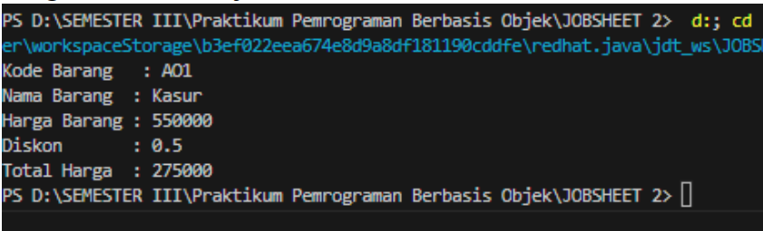


