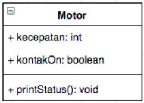
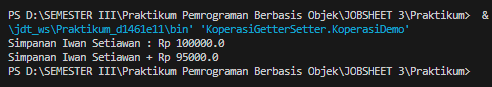
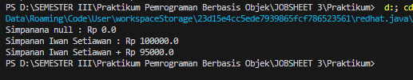
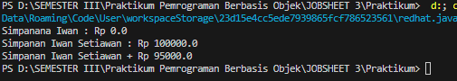
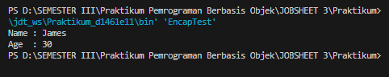
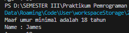
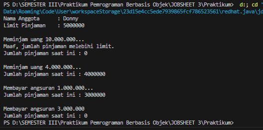
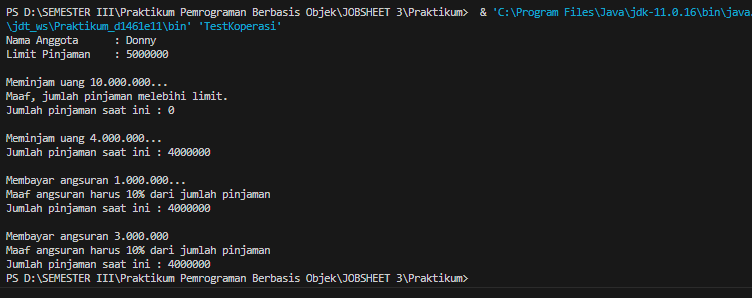

# Laporan Pemrograman Berbasis Objek 
# PERTEMUAN 3
## Disusun Oleh :
Nama        : Chyntia Santi Nur Trisnawati

Absen       : 08 (Delapan)

Kelas       : 2C

NIM         : 2241720017

## 3. PERCOBAAN
### 3.1 PERCOBAAN 1 - Enkapsulasi
Didalam percobaan enkapsulasi, buatlah class Motor yang memiliki atribut kecepatan dan kontakOn,
dan memiliki method printStatus() untuk menampilkan status motor. Seperti berikut
1. Buka Netbeans, buat project MotorEncapsulation.
2. Buat class Motor. Klik kanan pada package motorencapsulation – New – Java Class.
3. Ketikkan kode class Motor dibawah ini.
```java 
public class Motor {
    public int kecepatan = 0;
    public boolean kontakOn = false;

    public void printStatus(){
        if (kontakOn == true) {
            System.out.println("Kontak On");
        }
        else {
            System.out.println("Kontak Off");
        }
        System.out.println("Kecepatan " + kecepatan + "\n");
    }
}
```
bentuk UML class diagram class Motor adalah sebagai berikut:



4. Kemudian buat class MotorDemo, ketikkan kode berikut ini
``` java
public class MotorDemo {
    public static void main(String[] args) {
        Motor motor = new Motor();
        motor.printStatus();
        motor.kecepatan = 50;
        motor.printStatus();
    }
}
```
5. Hasilnya adalah sebagai berikut:


### 3.2 PERCOBAAN 2 - Access Modifier
Pada percobaan ini akan digunakan access modifier untuk memperbaiki cara kerja class Motor pada
percobaan ke-1.
1. Ubah cara kerja class motor sesuai dengan UML class diagram berikut.


2. Berdasarkan UML class diagram tersebut maka class Motor terdapat perubahan, yaitu:

a. Ubah access modifier kecepatan dan kontakOn menjadi private

b. Tambahkan method nyalakanMesin, matikanMesin, tambahKecepatan, kurangiKecepatan.
Implementasi class Motor adalah sebagai berikut:
```java
public class Motor {
    private int kecepatan = 0;
    private boolean kontakOn = false;
    public void nyalakanMesin(){
        kontakOn = true;
    }
    public void matikanMesin(){
        kontakOn = false;
        kecepatan = 0;
    }
    public void tambahKecepatan(){
        if(kontakOn == true){
            kecepatan += 5;
        }
        else {
            System.out.println("Kecepatan tidak bisa tertambah karena Mesin Off! \n");
        }
    }
    public void kurangiKecepatan(){
        if(kontakOn == true){
            kecepatan -= 5;
        }
        else {
            System.out.println("Kecepatan tidak bisa tertambah karena Mesin Off! \n");
        }
    }
    public void printStatus(){
        if (kontakOn == true){
            System.out.println("Kontak On");
        } else {
            System.out.println("Kontak Off");
        }
        System.out.println("Kecepatan " + kecepatan + "\n");
    }
}
```

3. Kemudian pada class MotorDemo, ubah code menjadi seperti berikut:
```java
public class MotorDemo {
    public static void main(String[] args) {
        Motor motor = new Motor();
        motor.printStatus();
        motor.tambahKecepatan();

        motor.nyalakanMesin();
        motor.printStatus();

        motor.tambahKecepatan();
        motor.printStatus();

        motor.tambahKecepatan();
        motor.printStatus();

        motor.tambahKecepatan();
        motor.printStatus();

        motor.matikanMesin();
        motor.printStatus();
    }
}
```
4. Hasilnya dari class MotorDemo adalah sebagai berikut:


Dari percobaan diatas, dapat kita amati sekarang atribut kecepatan tidak bisa diakses oleh pengguna dan diganti nilainya secara sembarangan. Bahkan ketika mencoba menambah kecepatan saat posisi kontak masih OFF, maka akan muncul notifikasi bahwa mesin OFF. Untuk mendapatkan kecepatanyang diinginkan, maka harus dilakukan secara gradual, yaitu dengan memanggil method
tambahKecepatan() beberapa kali. Hal ini mirip seperti saat kita mengendarai motor.

## 3.3 Pertanyaan
1. Pada class TestMobil, saat kita menambah kecepatan untuk pertama kalinya, mengapa
muncul peringatan “Kecepatan tidak bisa bertambah karena Mesin Off!”? 

``Jawab``

Karena status di print terlebih dahulu sehingga tulisan yang keluar adalah "Kecepatan tidak bisa bertambah karena Mesin Off!" dan mesin juga belum dihidupkan sehingga yang terjadi adalah mesin tetap off.

2. Mengapat atribut kecepatan dan kontakOn diset private? 

``Jawab``

Agar atribut kecepatan dan kontakOn hanya dapat dijalankan pada package yang sama sehingga mencegah akses lain dari luar class. Hal ini membuat data lebih terjaga keamanannya.


3. Ubah class Motor sehingga kecepatan maksimalnya adalah 100!

``Jawab``

Untuk meminimalisir banyaknya data maka saya mengubah kecepatan jika ditambahkan sebanyak 25
sehingga kode progra, yang dibentuk yakni

Pada Class Motor
```java
public class Motor {
    private int kecepatan = 0;
    private boolean kontakOn = false;
    public void nyalakanMesin(){
        kontakOn = true;
    }
    public void matikanMesin(){
        kontakOn = false;
        kecepatan = 0;
    }
    public void tambahKecepatan(){
        if(kontakOn == true){
            kecepatan += 25;
        }
        else {
            System.out.println("Kecepatan tidak bisa tertambah karena Mesin Off! \n");
        }
    }
    public void kurangiKecepatan(){
        if(kontakOn == true){
            kecepatan -= 5;
        }
        else {
            System.out.println("Kecepatan tidak bisa tertambah karena Mesin Off! \n");
        }
    }
    public void printStatus(){
        if (kontakOn == true){
            if(kecepatan == 100){
                System.out.println("Maaf Kecepatan sudah maksimal!");
            } else {
                System.out.println("Kontak On");
            }
        } else {
            System.out.println("Kontak Off");
        }
        System.out.println("Kecepatan " + kecepatan + "\n");
    }
}
```

Class pada MotorDemo
```java
public class MotorDemo {
    public static void main(String[] args) {
        Motor motor = new Motor();
        motor.printStatus();
        motor.tambahKecepatan();

        motor.nyalakanMesin();
        motor.printStatus();

        motor.tambahKecepatan();
        motor.printStatus();

        motor.tambahKecepatan();
        motor.printStatus();

        motor.tambahKecepatan();
        motor.printStatus();

        motor.tambahKecepatan();
        motor.printStatus();

        motor.matikanMesin();
        motor.printStatus();
    }
}

```
## 3.4 Percobaan 3 - Getter dan Setter
Misalkan di sebuah sistem informasi koperasi, terdapat class Anggota. Anggota memiliki atribut
nama, alamat dan simpanan, dan method setter, getter dan setor dan pinjam. Semua atribut pada
anggota tidak boleh diubah sembarangan, melainkan hanya dapat diubah melalui method setter,
getter, setor dan tarik. Khusus untuk atribut simpanan tidak terdapat setter karena simpanan akan
bertambah ketika melakukan transaksi setor dan akan berkurang ketika melakukan
peminjaman/tarik.
1. Berikut ini UML class buatlah class Mahasiswa pada program:


2. Sama dengan percobaan 1 untuk membuat project baru

a. Buka Netbeans, buat project KoperasiGetterSetter.

b. Buat class Anggota. Klik kanan pada package koperasigettersetter – New – Java
Class.

c. Ketikkan kode class Anggota dibawah ini.

```java
package KoperasiGetterSetter;

public class Anggota {
    private String nama;
    private String alamat;
    private float simpanan;

    public void setNama(String nama){
        this.nama = nama;
    }
    public void setAlamat(String alamat){
        this.alamat = alamat;
    }
    public String getNama(){
        return nama;
    }
    public String getAlamat(){
        return alamat;
    }
    public float getSimpanan(){
        return simpanan;
    }
    public void setor(float uang){
        simpanan += uang;
    }
    public void pinjam(float uang){
        simpanan -= uang;
    }
}
```

Jika diperhatikan pada class Anggota, atribut nama dan alamat memili masing-masing 1
getter dan setter. Sedangkan atribut simpanan hanya memiliki getSimpanan() saja, karena
seperti tujuan awal, atribut simpanan akan berubah nilainya jika melakukan transaksi setor()
dan pinjam/tarik().

3. Selanjutnya buatlah class KoperasiDemo untuk mencoba class Anggota.
```Java
package KoperasiGetterSetter;

public class KoperasiDemo {
    public static void main(String[] args) {
        Anggota anggota1 = new Anggota();
        anggota1.setNama("Iwan Setiawan");
        anggota1.setAlamat("Jalan Sukarno Hatta no 10");
        anggota1.setor(100000);
        System.out.println("Simpanan " + anggota1.getNama() + " : Rp " + anggota1.getSimpanan());

        anggota1.pinjam(5000);
        System.out.println("Simpanan " +anggota1.getNama() + " + Rp " + anggota1.getSimpanan());
    }
}
```
4. Hasil dari main method pada langkah ketiga adalah



Dapat dilihat pada hasil percobaan diatas, untuk mengubah simpanan tidak dilakukan secara
langsung dengan mengubah atribut simpanan, melainkan melalui method setor() dan pinjam().
Untuk menampilkan nama pun harus melalui method getNama(), dan untuk menampilkan simpanan
melalui getSimpanan().

## 3.5 Percobaan 4 - Konstruktor, Instansiasi
1. Langkah pertama percobaan 4 adalah ubah class KoperasiDemo seperti berikut
```Java
package KoperasiGetterSetter;

public class KoperasiDemo {
    public static void main(String[] args) {
        Anggota anggota1 = new Anggota();
        System.out.println("Simpanana " +anggota1.getNama() + " : Rp " + anggota1.getSimpanan());
        anggota1.setNama("Iwan Setiawan");
        anggota1.setAlamat("Jalan Sukarno Hatta no 10");
        anggota1.setor(100000);
        System.out.println("Simpanan " + anggota1.getNama() + " : Rp " + anggota1.getSimpanan());

        anggota1.pinjam(5000);
        System.out.println("Simpanan " +anggota1.getNama() + " + Rp " + anggota1.getSimpanan());
    }
}
```
2. Hasil dari program tersebut adalah sebagai berikut



Dapat dilihat hasil running program, ketika dilakukan pemanggilan method getNama()
hasilnya hal ini terjadi karena atribut nama belum diset nilai defaultnya. Hal ini dapat
ditangani dengan membuat kontruktor.

3. Ubah class Anggota menjadi seperti berikut
```java
package KoperasiGetterSetter;

public class Anggota {
    private String nama;
    private String alamat;
    private float simpanan;

    Anggota(String nama, String alamat){
        this.nama = nama;
        this.alamat = alamat;
        this.simpanan = 0;
    }
    public void setNama(String nama){
        this.nama = nama;
    }
    public void setAlamat(String alamat){
        this.alamat = alamat;
    }
    public String getNama(){
        return nama;
    }
    public String getAlamat(){
        return alamat;
    }
    public float getSimpanan(){
        return simpanan;
    }
    public void setor(float uang){
        simpanan += uang;
    }
    public void pinjam(float uang){
        simpanan -= uang;
    }
}
```

Pada class Anggota dibuat kontruktor dengan access modifier default yang memiliki 2
parameter nama dan alamat. Dan didalam konstruktor tersebut dipastikan nilai simpanan
untuk pertama kali adalah Rp. 0.

4. Selanjutnya ubah class KoperasiDemo sebagai berikut
```java
package KoperasiGetterSetter;

public class KoperasiDemo {
    public static void main(String[] args) {
        Anggota anggota1 = new Anggota("Iwan", "Jalan Mawar");
        System.out.println("Simpanana " +anggota1.getNama() + " : Rp " + anggota1.getSimpanan());
        
        anggota1.setNama("Iwan Setiawan");
        anggota1.setAlamat("Jalan Sukarno Hatta no 10");
        anggota1.setor(100000);
        System.out.println("Simpanan " + anggota1.getNama() + " : Rp " + anggota1.getSimpanan());

        anggota1.pinjam(5000);
        System.out.println("Simpanan " +anggota1.getNama() + " + Rp " + anggota1.getSimpanan());
    }
}
```
5. Hasil dari program tersebut adalah sebagai berikut



Setelah menambah konstruktor pada class Anggoata maka atribut nama dan alamat secara
otomatis harus diset terlebih dahulu dengan melakukan passing parameter jika melakukan
instansiasi class Anggota. Hal ini biasa dilakukan untuk atribut yang membutuhkan nilai yang
spesifik. Jika tidak membutuhkan nilai spesifik dalam konstruktor tidak perlu parameter.
Contohnya simpanan untuk anggota baru diset 0, maka simpanan tidak perlu untuk dijadikan
parameter pada konstruktor.

## 3.6 Pertanyaan – Percobaan 3 dan 4
1. Apa yang dimaksud getter dan setter?

``Jawab``

 Getter adalah metode yang digunakan untuk mengambil atau membaca nilai dari suatu atribut privat dalam class. Getter sering kali memiliki nama yang dimulai dengan "get" diikuti oleh nama atribut yang ingin dibaca.

 Setter adalah metode yang digunakan untuk mengubah atau mengatur nilai dari suatu atribut privat dalam class. Setter sering kali memiliki nama yang dimulai dengan "set" diikuti oleh nama atribut yang ingin diubah. 


2. Apa kegunaan dari method getSimpanan()?

``Jawab``
Untuk menyimpan nilai dari jumlah simpanan yang dimiliki.

3. Method apa yang digunakan untk menambah saldo?

``Jawab``

Untuk menambah saldo menggunakan Method "Setor"

4. Apa yand dimaksud konstruktor?

``Jawab``

Constructor adalah method khusus yang akan dieksekusi pada saat pembuatan objek (instance).
Biasanya method ini digunakan untuk inisialisasi atau mempersiapkan data untuk objek.

5. Sebutkan aturan dalam membuat konstruktor?

``Jawab``

A Nama konstruktor harus sama dengan nama class                                            
B Konstruktor tidak memiliki tipe data return                                          
C Konstruktor tidak boleh menggunakan modifier abstract, static, final, dan syncronized

6. Apakah boleh konstruktor bertipe private?

``Jawab``
Boleh, dalam beberapa bahasa pemrograman, seperti Java bisa membuat konstruktor dengan tingkat akses "private" atau "private constructor." Sehingga konstruktor hanya dapat diakses dan dipanggil dari dalam class itu sendiri, dan tidak dapat diakses dari luar class.

Ada beberapa 

7. Kapan menggunakan parameter dengan passsing parameter?

``Jawab``
passing parameter adalah tindakan mengirim data konkret ke fungsi atau metode melalui parameter. Pemilihan kapan dan bagaimana menggunakan parameter dengan passing parameter tergantung pada beberapa faktor, seperti bahasa pemrograman yang digunakan, kompleksitas program, dan kebutuhan spesifik aplikasi. Beberapa penggunaan Passing Parameter yaitu :

a. Parameter digunakan untuk mengirim data ke dalam fungsi atau metode.                       
b. Menggunakan passing parameter saat mengambil data dari sumber eksternal, seperti input pengguna atau bacaan dari berkas, dan kemudian mengirimkan data ini ke dalam fungsi atau metode untuk diproses.                                                                                
c. Parameter digunakan untuk menghindari duplikasi kode dengan memungkinkan Anda untuk mengirim data yang berbeda ke fungsi atau metode yang sama.                                               
d. Menggunakan passing parameter untuk mengirim fungsi sebagai parameter ke fungsi lain.

8. Apa perbedaan atribut class dan instansiasi atribut?

``Jawab``

Atribut class 

a. Dibagikan oleh Seluruh Instance: Atribut kelas adalah atribut yang terkait dengan class itu sendiri, bukan dengan instance objek yang diciptakan dari class tersebut. Ini berarti bahwa nilai atribut kelas bersifat bersama dan dibagikan oleh semua instance dari class yang sama.

b. Deklarasi di Luar Metode: Atribut kelas dideklarasikan di luar metode dalam class, biasanya di bagian atas class.

c. Dapat Diakses Melalui Class: Anda dapat mengakses atribut kelas baik melalui instance dari class atau langsung melalui class itu sendiri.

Atribut Instansiasi (Instance Attributes):

a. Berbeda untuk Setiap Instance: Atribut instansiasi adalah atribut yang terkait dengan instance objek yang diciptakan dari class. Setiap instance memiliki salinan atribut instansiasi yang berbeda, dan perubahan pada atribut ini hanya memengaruhi instance yang bersangkutan.

b. Deklarasi dalam Metode Konstruktor: Atribut instansiasi biasanya dideklarasikan dalam metode konstruktor (biasanya bernama __init__) dan diinisialisasi dengan nilai yang berbeda untuk setiap instance.

c. Dapat Diakses Melalui Instance: Atribut instansiasi hanya dapat diakses melalui instance objek yang bersangkutan.

9. Apa perbedaan class method dan instansiasi method?

a. Definisi:

Class Method: Class method adalah metode yang didefinisikan dalam class dan diberi tanda dengan decorator @classmethod. Metode ini memiliki parameter khusus pertama yang biasanya dinamai cls (singkatan dari "class") untuk merujuk ke class itu sendiri. Class method dapat diakses melalui class itu sendiri tanpa harus membuat instance objek.

Instance Method: Instance method adalah metode yang didefinisikan dalam class dan tidak diberi dekorator khusus. Metode ini memiliki parameter khusus pertama yang biasanya dinamai self untuk merujuk ke instance objek yang memanggil metode tersebut. Instance method hanya dapat diakses melalui instance objek.

b. Akses ke Class Attributes:

Class Method: Class method dapat mengakses dan mengubah atribut kelas (class attributes) karena mereka memiliki akses ke class itu sendiri. Ini berguna untuk operasi yang melibatkan atribut kelas yang bersifat bersama antara semua instance objek dari class tersebut.

Instance Method: Instance method biasanya digunakan untuk mengakses dan mengubah atribut instansiasi (instance attributes) karena mereka memiliki akses ke instance objek. Mereka cocok untuk operasi yang berkaitan dengan data yang unik untuk setiap instance objek.

c. Cara Pemanggilan:

Class Method: Class method dapat dipanggil baik melalui class itu sendiri atau melalui instance objek. Ketika dipanggil melalui class, parameter cls secara otomatis mengacu pada class.

Instance Method: Instance method hanya dapat dipanggil melalui instance objek, dan parameter self secara otomatis mengacu pada instance objek yang memanggilnya.

d. Keperluan Instance Objek:

Class Method: Class method tidak memerlukan instance objek. Mereka cocok untuk operasi yang tidak bergantung pada data yang unik untuk instance objek.

Instance Method: Instance method memerlukan instance objek yang valid untuk dapat dipanggil. Mereka biasanya digunakan untuk berinteraksi dengan atribut dan metode instance objek.

## 5. Tugas
1. Cobalah program dibawah ini dan tuliskan hasil outputnya

Class EncapDemo

```Java

public class EncapDemo {
    private String name;
    private int age;

    public String getName(){
        return name;
    }

    public void setName(String newName){
        name = newName;
    }

    public int getAge(){
        return age;
    }

    public void setAge(int newAge){
        if(newAge > 30){
            age = 30;
        } else {
            newAge = age;
        }
    }

}
```

Class Encap Test

```java
public class EncapTest {
    public static void main(String[] args) {
        EncapDemo encap = new EncapDemo();
        encap.setName("James");
        encap.setAge(35);

        System.out.println("Name : " + encap.getName());
        System.out.println("Age  : " + encap.getAge());
    }
}
```

2. Pada program diatas, pada class EncapTest kita mengeset age dengan nilai 35, namun pada
saat ditampilkan ke layar nilainya 30, jelaskan mengapa.

``Jawaban``

Karena pada bagia "setAge" jika Age lebih dari 30. Maka umur sama dengan 30. Sehingga ketika umur James adalah 35. Diketahui adalah 35 lebih dari 30 dimana program akan memproses umur hanya akan menjadi 30. Oleh sebab itu umur yang ditampilkan di layar tetap 30



3. Ubah program diatas agar atribut age dapat diberi nilai maksimal 30 dan minimal 18.

Kode EncapDemo
```java
public class EncapDemo {
    private String name;
    private int age;

    public String getName(){
        return name;
    }

    public void setName(String newName){
        name = newName;
    }

    public int getAge(){
        return age;
    }

    public void setAge(int newAge){
        if(newAge > 30 ){
            age = 30;
            System.out.println("Maaf umur maksimal adalah 30 tahun");
        }if(newAge < 18){
            age = 18;
            System.out.println("Maaf umur minimal adalah 18 tahun");
        } else {
            newAge = age;
        }
    }

}
```

Class EncapTest 
```java
public class EncapTest {
    public static void main(String[] args) {
        EncapDemo encap = new EncapDemo();
        encap.setName("James");
        encap.setAge(17);

        System.out.println("Name : " + encap.getName());
        System.out.println("Age  : " + encap.getAge());
    }
}
```
Jika dijalankan adalah sebagai berikut



4. Pada sebuah sistem informasi koperasi simpan pinjam, terdapat class Anggota yang memiliki
atribut antara lain nomor KTP, nama, limit peminjaman, dan jumlah pinjaman. Anggota
dapat meminjam uang dengan batas limit peminjaman yang ditentukan. Anggota juga dapat
mengangsur pinjaman. Ketika Anggota tersebut mengangsur pinjaman, maka jumlah
pinjaman akan berkurang sesuai dengan nominal yang diangsur. Buatlah class Anggota
tersebut, berikan atribut, method dan konstruktor sesuai dengan kebutuhan. Uji dengan
TestKoperasi berikut ini untuk memeriksa apakah class Anggota yang anda buat telah sesuai
dengan yang diharapkan.

Kode Program Class Anggota
```java
public class Anggota {
    
    private String nomor;
    private String nama;
    private int simpananAnggota;

    Anggota(String nomor, String nama, int simpanAnggota){
        this.nomor = nomor;
        this.nama = nama;
        this.simpananAnggota = 0;
    }
    public void setNama(String nama){
        this.nama = nama;
    }
    public int getLimitPinjaman(int simpan){
        simpan = 5000000;
        return simpan;
    }
    public String getNama(){
        return nama;
    }
    
    public int getJumlahPinjaman(){
        return simpananAnggota;
    }

    public void pinjam(int uang){
        if(uang > 5000000){
            System.out.println("Maaf, jumlah pinjaman melebihi limit.");
        } else {
            simpananAnggota += uang;
            uang = simpananAnggota;
        }
    }

    public void angsur(int uang){
        simpananAnggota -= uang;
    }
}
```

Kode Program Class TestKoperasi
```java


public class TestKoperasi {
        public static void main(String[] args) {
        Anggota donny = new Anggota("111333444", "Donny", 5000000);
        System.out.println("Nama Anggota      : " +donny.getNama());
        System.out.println("Limit Pinjaman    : " + donny.getLimitPinjaman(0));
        
        System.out.println("\nMeminjam uang 10.000.000...");
        donny.pinjam(10000000);
        System.out.println("Jumlah pinjaman saat ini : " + donny.getJumlahPinjaman());

        System.out.println("\nMeminjam uang 4.000.000...");
        donny.pinjam(4000000);
        System.out.println("Jumlah pinjaman saat ini : " + donny.getJumlahPinjaman());

        System.out.println("\nMembayar angsuran 1.000.000...");
        donny.angsur(1000000);
        System.out.println("Jumlah pinjaman saat ini : " + donny.getJumlahPinjaman());

        System.out.println("\nMembayar angsuran 3.000.000");
        donny.angsur(3000000);
        System.out.println("Jumlah pinjaman saat ini : " + donny.getJumlahPinjaman());
    }
}
```

Program ketika di jalankan



5. Modifikasi soal no. 4 agar nominal yang dapat diangsur minimal adalah 10% dari jumlah
pinjaman saat ini. Jika mengangsur kurang dari itu, maka muncul peringatan “Maaf,
angsuran harus 10% dari jumlah pinjaman”.

Hasil Modifikasi Class Anggota

```java
public class Anggota {
    
    private String nomor;
    private String nama;
    private int simpananAnggota;

    Anggota(String nomor, String nama, int simpanAnggota){
        this.nomor = nomor;
        this.nama = nama;
        this.simpananAnggota = 0;
    }
    public void setNama(String nama){
        this.nama = nama;
    }
    public int getLimitPinjaman(int simpan){
        simpan = 5000000;
        return simpan;
    }
    public String getNama(){
        return nama;
    }
    
    public int getJumlahPinjaman(){
        return simpananAnggota;
    }

    public void pinjam(int uang){
        if(uang > 5000000){
            System.out.println("Maaf, jumlah pinjaman melebihi limit.");
        } else {
            simpananAnggota += uang;
            uang = simpananAnggota;
        }
    }

    public void angsur(int uang){
        if(uang < 10*uang/100){
            simpananAnggota -= uang;
        } else {
            System.out.println("Maaf angsuran harus 10% dari jumlah pinjaman");
        }
    }
}
```

Modifikasi class TestKoperasi
 ```java
 

public class TestKoperasi {
        public static void main(String[] args) {
        Anggota donny = new Anggota("111333444", "Donny", 5000000);
        System.out.println("Nama Anggota      : " +donny.getNama());
        System.out.println("Limit Pinjaman    : " + donny.getLimitPinjaman(0));
        
        System.out.println("\nMeminjam uang 10.000.000...");
        donny.pinjam(10000000);
        System.out.println("Jumlah pinjaman saat ini : " + donny.getJumlahPinjaman());

        System.out.println("\nMeminjam uang 4.000.000...");
        donny.pinjam(4000000);
        System.out.println("Jumlah pinjaman saat ini : " + donny.getJumlahPinjaman());

        System.out.println("\nMembayar angsuran 1.000.000...");
        donny.angsur(1000000);
        System.out.println("Jumlah pinjaman saat ini : " + donny.getJumlahPinjaman());

        System.out.println("\nMembayar angsuran 3.000.000");
        donny.angsur(250000);
        System.out.println("Jumlah pinjaman saat ini : " + donny.getJumlahPinjaman());
    }
}
```

Hasil ketika dijalankan ketika angsuran kedua bernilai Rp 250.000 adalah
 ;