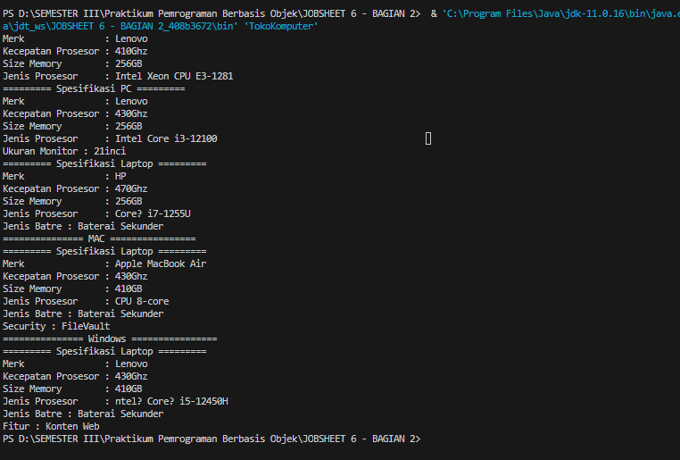

# JOBESHEET 6 - INHERITANCE 2

Nama  : Chyntia Santi Nur Trisnawati                          
Kelas : 2C                         
Absen : 08 (Delapan)               
NIM : 2241720017

## Percobaan 1
A. TAHAPAN PERCOBAAN                    
Perhatikan diagram class dibawah ini:


1. Buatlah class Karyawan
```java
public class Karyawan{
    public String  nama, alamat, jk;
    public int umur, gaji;

    public Karyawan() {

    }
    public Karyawan(String nama, String alamat, String jk, int umur, int gaji){
        this.nama = nama;
        this.alamat = alamat;
        this.jk = jk;
        this.umur = umur;
        this.gaji = gaji;
    }

    public void tampilDataKaryawan(){
        System.out.println("Nama            : " +nama);
        System.out.println("Alamat          : " +alamat);
        System.out.println("Jenis Kelamin   : " +jk);
        System.out.println("Umur            : " +umur);
        System.out.println("Gaji            : " +gaji);
    }
}
```

2. Buat Class Manager
```java
public class Manager extends Karyawan {
    public int tunjangan;

    public Manager(){

    }

    public void tampilDataManager(){
        super.tampilDataKaryawan();
        System.out.println("Tunjangan       : " +tunjangan);
        System.out.println("Total Gaji      : " +(super.gaji+tunjangan));
    }
}
```

3. Buat Class Staff
```java
public class Staff extends Karyawan{
    public int lembur, potongan;

    public Staff(){

    }

    public Staff(String nama, String alamat, String jk, int umur, int gaji, int lembur, int potongan){
        super(nama, alamat, jk, umur, gaji);
        this.lembur = lembur;
        this.potongan = potongan;
    }

    public void tampilDataStaff(){
        super.tampilDataKaryawan();
        System.out.println("Lembur          : " +lembur);
        System.out.println("Potongan        : " +potongan);
        System.out.println("Total Gaji      : " +(gaji+lembur-potongan));
    }
}
```
4. Buatlah class Inheritance1
```java
public class Inheritance1 {
    public static void main(String[] args) {
        Manager M = new Manager();
        M.nama = "Vivin";
        M.alamat = "Jl. Vinolia";
        M.umur = 25;
        M.jk = "Perempuan";
        M.gaji = 30000000;
        M.tunjangan = 1000000;
        M.tampilDataManager();
        
        Staff S = new Staff(null, null, null, 0, 0, 0, 0);
        S.nama = "Lestari";
        S.alamat = "Malang";
        S.umur = 25;
        S.jk = "Perempuan";
        S.gaji = 2000000;
        S.lembur = 5000000;
        S.potongan = 250000;
        S.tampilDataStaff();
    }
}
```
Jalankan program, maka tampilannya adalah sebagai berikut


### PERTANYAAN 
1. Sebutkan class mana yang termasuk super class dan sub class dari percobaan 1 diatas!                 
Jawab:                              
Super Class dari ketiga class tersebut adalah Class Karyawan. Sedangkan Subclass dari Class Karyawan adalah Manager dan Staff.

2. Kata kunci apakah yang digunakan untuk menurunkan suatu class ke class yang lain?                     
Jawab :      
Dalam pemrograman berorientasi objek, kata kunci yang digunakan untuk menurunkan suatu class ke class yang lain adalah "extends"

3. Perhatikan kode program pada class Manager, atribut apa saja yang dimiliki oleh class
tersebut? Sebutkan atribut mana saja yang diwarisi dari class Karyawan        
Jawab :                                   
tunjangan (public int): Ini adalah atribut yang dimiliki oleh class Manager dan mewakili tunjangan yang diterima oleh seorang manajer.

4. Jelaskan kata kunci super pada potongan program dibawah ini yang terdapat pada class
Manager!
```java
 System.out.println("Total Gaji      : " +(super.gaji+tunjangan));
 ```
Jawab :                         
super.gaji mengacu pada atribut gaji dari superclass, yaitu class Karyawan. Class Manager mewarisi atribut gaji dari class Karyawan. Dengan menggunakan super, kita dapat mengakses atribut gaji dari class Karyawan dari dalam class Manager.

5. Program pada percobaan 1 diatas termasuk dalam jenis inheritance apa? Jelaskan
alasannya!                   
Jawab:                         
Termasuk dalam Hierarchical Inheritane. Karena kelas memiliki lebih dari satu kelas turunan. atau lebih dari satu kelas turunan yang memiliki kelas induk yang sama. Karena pada kelas Karyawan memiliki dua anak turunan yaitu Staff dan Manager

## 4.PERCOBAAN 2
### 1. TAHAPAN PERCOBAAN
Perhatikan digram class dibawah ini


Berdasarkan program yang sudah anda buat pada percobaan 1 sebelumnya
tambahkan dua class yaitu class StaffTetap dan class StaffHarian. Kode
Programnya adalah sebagai berikut     

Class StaffTetap.java
```java
public class StaffTetap extends Staff {
    public String golongan;
    public int asuransi;

    public StaffTetap(){

    }
    public StaffTetap(String nama, String alamat, String jk, int umur, int gaji, int lembur, int potongan, String golongan, int asuransi){
        super(nama, alamat, jk, umur, gaji, lembur, potongan);
        this.golongan = golongan;
        this.asuransi = asuransi;
    }

    public void tampilStaffTetap(){
        System.out.println("================== Data Staff Tetap =====================");
        super.tampilDataStaff();
    }
}
```
Class StaffHarian.java
```java
public class StaffHarian extends Staff {
    public int jmlJamKerja;

    public StaffHarian(){

    }

    public StaffHarian(String nama, String alamat, String jk, int umur, int gaji, int lembur, int potongan, int jmlJamKerja) {
        super(nama, alamat, jk, umur, gaji, lembur, potongan);
        this.jmlJamKerja = jmlJamKerja;
    }

    public void tampilStaffHarian(){
        System.out.println("=================== Data Staff Harian ========================");
        super.tampilDataStaff();
        System.out.println("Jumlah Jam Kerja : " +jmlJamKerja);
        System.out.println("Gaji Bersih     : " +(gaji*jmlJamKerja+lembur-potongan) );
    }

}
```
Setelah membuat dua class diatas kemudian edit class inheritance1.java
menjadi sebagai berikut
```java
public class Inheritance1 {
    public static void main(String[] args) {
        StaffTetap ST = new StaffTetap("Budi", "Malang", "Laki-Laki", 20, 2000000, 250000, 2000000, "2A", 1000000);
        ST.tampilStaffTetap();

        StaffHarian SH = new StaffHarian("Indah", "Malang", "Perempuan", 27, 100000, 1000000, 50000, 1000);
        SH.tampilStaffHarian();
    }
}
```
Jalankan program maka tampilanny adalah sebagai berikut:


## 2. PERTANYAAN
• Berdasarkan class diatas manakah yang termasuk single inheritance
dan mana yang termasuk multilevel inheritance?                                                
Jawab :                                
a. Single Inheritance adalah Staff dan Manager karena dapat mewarisi sifat dan perilaku dari satu class lainnya (class induk atau superclass) yaitu Class Kariawan                     
b. Multilevel Inheritance adalah Class dalah Class StaffHarian dan StaffTetap yang merupakan anak turunan dari Class Staff sehingga Staff mewarisi sifat dan perilaku dari class lain, yang pada gilirannya dapat menjadi superclass untuk class lainnya. 

• Perhatikan kode program class StaffTetap dan StaffHarian, atribut apa saja yang
dimiliki oleh class tersebut? Sebutkan atribut mana saja yang diwarisi dari class
Staff!                         
Jawab:            
a. Atribut pada Class StaffTetap adalah 
```java
public String golongan;
    public int asuransi;
```
b. Atribut dari Class StaffHarian adalah:
```java
public int jmlJamKerja;
```
c. Atribut yang diwarisi dari Class Staff adalah:
```java
public int lembur, potongan;
```
Karena Class Staff berhubungan dengan Class Karyawan maka terdapat pula atribut
```java
String nama, String alamat, String jk, int umur, int gaji
```
• Apakah fungsi potongan program berikut pada class StaffHarian    
Jawab:  
```java
super(nama, alamat, jk, umur, gaji, lembur, potongan);
```
Jawab :        
Fungsi potongan program super(nama, alamat, jk, umur, gaji, lembur, potongan); digunakan dalam constructor (konstruktor) class StaffHarian untuk memanggil constructor class superclass (induk) dari StaffHarian. Dalam konteks ini, super digunakan untuk menginisialisasi atribut-atribut dari class StaffHarian yang diwarisi dari class superclass.

• Apakah fungsi potongan program berikut pada class StaffHarian    
```java 
super.tampilDataStaff();
```
Jawab :   
Digunakan untuk memanggil metode tampilDataStaff() dari class superclass (induk) dalam class StaffHarian. 

•  Perhatikan kode program dibawah ini yang terdapat pada class StaffTetap
```java
System.out.println("Gaji Bersih     : " +(gaji*jmlJamKerja+lembur-potongan) );
```
Terlihat dipotongan program diatas atribut gaji, lembur dan potongan dapat diakses
langsung. Kenapa hal ini bisa terjadi dan bagaimana class StaffTetap memiliki atribut gaji,
lembur, dan potongan padahal dalam class tersebut tidak dideklarasikan atribut gaji, lembur,
dan potongan?    
Jawab:        
Jika atribut gaji, lembur, dan potongan dideklarasikan dan diinisialisasi dalam class superclass yang kemudian digunakan dalam class StaffTetap, maka class StaffTetap akan mewarisi atribut-atribut tersebut secara otomatis.

## 5.TUGAS
1. Buatlah sebuah program dengan konsep pewarisan seperti pada class diagram berikut ini.
Kemudian buatlah instansiasi objek untuk menampilkan data pada class Mac, Windows dan
Pc!.

Jawab :    
Class Komputer
```java
public class Komputer {
    public String merk, jnsProsesor;
    public int kecProsesor, sizeMemory;

    public Komputer(){

    }

    public Komputer(String merk, String jnsProsesor, int kecProsesor, int sizeMemory){
        this.merk = merk;
        this.jnsProsesor = jnsProsesor;
        this.kecProsesor = kecProsesor;
        this.sizeMemory = sizeMemory;
    }

    public void tampilData(){
        System.out.println("Merk               : " +merk);
        System.out.println("Kecepatan Prosesor : " +kecProsesor + "Ghz");
        System.out.println("Size Memory        : " +sizeMemory + "GB");
        System.out.println("Jenis Prosesor     : " +jnsProsesor);
    }
}
```
Class Laptop
```java
public class Laptop extends Komputer {
    public String jnsBatre;
    
     public Laptop(){
    
        }
        public Laptop(String merk, String jnsProsesor, int kecProsesor, int sizeMemory, String jnsBatre){
            super(merk, jnsProsesor, kecProsesor, sizeMemory);
            this.jnsBatre = jnsBatre;
        }
    
        public void tampilLaptop(){
            System.out.println("========= Spesifikasi Laptop =========");
            super.tampilData();
            System.out.println("Jenis Batre : " +jnsBatre);
        }
    
}
```
Class PC
```java
public class Pc extends Komputer{
    public int ukuranMonitor;

    public Pc(){

    }
    public Pc(String merk, String jnsProsesor, int kecProsesor, int sizeMemory, int ukuranMonitor){
        super(merk, jnsProsesor, kecProsesor, sizeMemory);
        this.ukuranMonitor = ukuranMonitor;
    }

    public void tampilPc(){
        System.out.println("========= Spesifikasi PC =========");
        super.tampilData();
        System.out.println("Ukuran Monitor : " +ukuranMonitor + "inci");
    }
}
```
Class Mac
```java
public class Mac extends Laptop {
    public String security;
    public Mac(){

    }
    public Mac(String merk, String jnsProsesor, int kecProsesor, int sizeMemory, String jnsBatre, String security){
        super(merk, jnsProsesor, kecProsesor, sizeMemory, jnsBatre);
        this.security = security;
    }

    public void tampilMac(){
        System.out.println("=============== MAC ================");
        super.tampilLaptop();
        System.out.println("Security : " +security);
    }
    
}
```
Class Windows
```java
public class Windows extends Laptop {
    String fitur;

    public Windows(){

    }
    public Windows(String merk, String jnsProsesor, int kecProsesor, int sizeMemory, String jnsBatre, String fitur){
        super(merk, jnsProsesor, kecProsesor, sizeMemory, jnsBatre);
        this.fitur = fitur;
    }

    public void tampilWindows(){
        System.out.println("=============== Windows ================");
        super.tampilLaptop();
        System.out.println("Fitur : " +fitur);
    }
}
```

Class TokoKomputer
```java
public class TokoKomputer {
    public static void main(String[] args) {
        Komputer K = new Komputer("Lenovo", "Intel Xeon CPU E3-1281", 410, 256);
        K.tampilData();

        Pc P = new Pc("Lenovo", "Intel Core i3-12100", 430, 256, 21);
        P.tampilPc();

        Laptop L = new Laptop("HP", "Core™ i7-1255U", 470, 256, "Baterai Sekunder");
        L.tampilLaptop();

        Mac M = new Mac("Apple MacBook Air ", "CPU 8-core", 430, 410, "Baterai Sekunder", "FileVault");
        M.tampilMac();

        Windows W = new Windows("Lenovo", "ntel® Core™ i5-12450H ", 430, 410,  "Baterai Sekunder", "Konten Web");
        W.tampilWindows();
    }
}
```

Hasil Krika dijalankan adalah sebagai berikut


