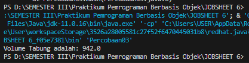

# TUGAS INHERITANCE 
Nama    : Chyntia Santi Nur Trisnawati                                                        
Kelas   : 2C                                                                     
Absen   : 08 (Delapan)                                                            
NIM     : 2241720017

# 3.	PERCOBAAN 1 (extends)
## A.	TAHAPAN PERCOBAAN
1.	Buatlah sebuah class parent/superclass dengan nama ClassA.java
```java
public class ClassA{
    public int x;
    public int y;

    public void getNilai (){
        System.out.println("nilai x : " + x);
        System.out.println("nilai y : " + y);
    }
}
```

2.	Buatlah sebuah class anak/subclass dengan nama ClassB.java
```java
public class ClassB {
    public int z;

    public void getNilaiZ(){
        System.out.println("nilai  Z : " + z);
    }
    public void getJumlah(){
        System.out.println("jumlah : " + (x+y+z));
    }
}
```
3.  Buatlah class Percobaan1.java untuk menjalankan program diatas!
```java
public class Percobaan1 {
    public static void main(String[] args) {
        ClassB hitung = new ClassB();
        hitung.x= 20;
        hitung.y= 30;
        hitung.z= 5;
        hitung.getNilai();
        hitung.getNilaiZ();
        hitung.getJumlah();
    }
}
```
4.	Jalankan program diatas, kemudian amati apa yang terjadi!                                        
Ketika program dilankan maka yang terjadi adalah sebagai berikut


B.	PERTANYAAN
1.	Pada percobaan 1 diatas program yang dijalankan terjadi error, kemudian perbaiki sehingga program tersebut bisa dijalankan dan tidak error!                        
Jawab :                                                                                            
Karena Tidak ada "extends" yang mengkonekkan antara Class A dan Class B, sehingga hal itu bisa terjadi. Kode program yang perlu diperbaiki adalah pada Class B sebagai berikut:
```java
public class ClassB extends ClassA{
    public int z;

    public void getNilaiZ(){
        System.out.println("nilai  Z : " + z);
    }
    public void getJumlah(){
        System.out.println("jumlah : " + (x+y+z));
    }
}
```
Sehingga hasil ketika dijalankan adalah sebagai berikut


2.	Jelaskan apa penyebab program pada percobaan 1 ketika dijalankan terdapat error!      
   Jawab :           
   Karena tidak terdapat "Entends" pada Class B untuk memberikan koneksi antara class A dan class B karena terdapat atribut Class A yang ada pada Class B. Begitu pula pada Class Percobaan1, untuk menjalankan class ini membuat konstruktor dari class B sehingga jika tidak di koneksikan dengan Class A program tidak akan berjalan

# 4.	PERCOBAAN 2 (Hak Akses)
## A.	TAHAPAN PERCOBAAN
1.	Buatlah sebuah class parent/superclass dengan nama ClassA.java
```java
public class ClassA{
    public int x;
    public int y;

    public void setX (int x){
        this.x = x;
    }

    public void setY(int y){
        this.y = y;
    }
    public void getNilai (){
        System.out.println("nilai x : " + x);
        System.out.println("nilai y : " + y);
    }
}
```
2.	Buatlah sebuah class anak/subclass dengan nama ClassB.java
```java 
public class ClassB {
    private int z;

    public void setZ(int z){
        this.z = z;
    }

    public void getNilaiZ(){
        System.out.println("nilai  Z : " + z);
    }
    public void getJumlah(){
        System.out.println("jumlah : " + (x+y+z));
    }
}
```

3.	Buatlah class Percobaan2.java untuk menjalankan program diatas!
```java
public class Percobaan2 {
    public class Percobaan1 {
        public static void main(String[] args) {
            ClassB hitung = new ClassB();
            hitung.setX(20);
            hitung.setY(30);
            hitung.setZ(5);
            hitung.getNilai();
            hitung.getNilaiZ();
            hitung.getJumlah();
        }
    }
    
}
```
4.	Jalankan program diatas, kemudian amati apa yang terjadi!


Yang terjadi adalah program yang dijalankan eror

## B.	PERTANYAAN
1.	Pada percobaan 2 diatas program yang dijalankan terjadi error, kemudian perbaiki sehingga program tersebut bisa dijalankan dan tidak error!                  
Jawab:       
Agar program tidak eror maka yang perlu dilakukan adalah menambahkan extends pada class B seperti berikut :
```java
public class ClassB extends ClassA{
    private int z;

    public void setZ(int z){
        this.z = z;
    }

    public void getNilaiZ(){
        System.out.println("nilai  Z : " + z);
    }
    public void getJumlah(){
        System.out.println("jumlah : " + (x+y+z));
    }
}
```
Sehingga ketika program dijalankan adalah sebagai berikut


2.	Jelaskan apa penyebab program pada percobaan 1 ketika dijalankan terdapat error!          
Jawab:                
Penyebab program eror adalah karena tidak di konekkan dengan Class A menggunakan Extends

# 5.	PERCOBAAN 3 (Super)
## A.	TAHAPAN PERCOBAAN
1.	Buatlah sebuah class parent/superclass dengan nama Bangun.java
```java
public class Bangun {
    protected double phi;
    protected int r;
}
```
2.	Buatlah sebuah class anak/subclass dengan nama Tabung.java
```java
public class Tabung extends Bangun {
    protected int t;
    public void setSuperPhi (double phi){
        super.phi = phi;
    }
    public void setSuperR (int r){
        super.r = r;
    }
    public void setT(int t){
        this.t = t;
    }

    public void volume(){
        System.out.println("Volume Tabung adalah: "+(super.phi*super.r*super.r*this.t));
    }
}
```
3.	Buatlah class Percobaan3.java untuk menjalankan program diatas!
```java
public class Percobaan03 {
    public static void main(String[] args) {
        Tabung tabung = new Tabung();
        tabung.setSuperPhi(3.14);
        tabung.setSuperR(10);
        tabung.setT(3);
        tabung.volume();
    }
}
```
4.	Jalankan program diatas!


## B.	PERTANYAAN
1.	Jelaskan fungsi “super” pada potongan program berikut di class Tabung!
```java
public void setSuperPhi (double phi){
        super.phi = phi;
    }
    public void setSuperR (int r){
        super.r = r;
    }
```

Jawab                                            
Fungsi "super" pada kode program tersebut berfungsi untung memanggil atribut yang berada di SeperClass Sehingga atribut tidak perlu di ketik ulang, jadi tinggal dipanggil saja

2.	Jelaskan fungsi “super” dan “this” pada potongan program berikut di class Tabung!
```java
 public void volume(){
        System.out.println("Volume Tabung adalah: "+(super.phi*super.r*super.r*this.t));
} 
```             
Jawab               
Fungsi "super" digunakan untuk memanggil atribut pada class A, sehingga ketika dimasukkan nomina pada phi dan r akan otomatis masuk juga di aritmatika tersebut, Sedangkan fungsi "this" adalah return.

3.	Jelaskan mengapa pada class Tabung tidak dideklarasikan atribut “phi” dan “r” tetapi class tersebut dapat mengakses atribut tersebut!                    
Jawab :                            
Karena telah di memanggil menggunakan atribut extends sehingga tidak perlu memanggil ulang karena sudah terkonekkan dan memanggil atribut dengan super.nama atribut jadi angka akan terotomatis akan masuk.


# 6.	PERCOBAAN 4 (super contsructor)
## A.	TAHAPAN PERCOBAAN
1.	Buatlah tiga file dengan nama ClassA.java , ClassB.java , dan ClassC.java, seperti pada kode program dibawah ini!
ClassA.java                     
Jawab :                         
Class A
```java
public class ClassAa {
    ClassAa(){
        System.out.println("Konstruktor A dijalankan");
    }
    
}
```

Class B
```java
public class ClassBb extends ClassAa {
    ClassBb(){
        System.out.println("Konstruktor A dijalankan");
    }
    
}

```

Class C
```java
public class ClassCc extends ClassBb {
    public ClassCc(){
        System.out.println("konstruktor C dijalankan");
    }
}

```

2.	Buatlah class Percobaan4.java untuk menjalankan program diatas!
```java
public class Percobaan4 {
    public static void main(String[] args) {
        ClassCc test = new ClassCc();
    }
}
```

3. Jalankan program kemudian amati apa yang terjadi!


## B.	PERTANYAAN
1.	Pada percobaan 4 sebutkan mana class yang termasuk superclass dan subclass, kemudian jelaskan alasannya!         
Jawab:     
Superclass dari Class B adalah Class A, sehingga Class B merupakann Subclass. Sedangkan Superclass dari Class C adalah Class B, sehingga Class C adalag subclass

2.	Ubahlah isi konstruktor default ClassC seperti berikut:
```java
public class ClassCc extends ClassBb {
    public ClassCc(){
        super();
        System.out.println("konstruktor C dijalankan");
    }
}
```
Tambahkan kata super() di baris Pertaman dalam konstruktor defaultnya. Coba jalankan kembali class Percobaan4 dan terlihat tidak ada perbedaan dari hasil outputnya!

Jawab:     
Hasil ketika program dujalankan adalah sebagai berikut :
      

3.	Ublah isi konstruktor default ClassC seperti berikut:
```java
public class ClassCc extends ClassBb {
    public ClassCc(){
        System.out.println("konstruktor C dijalankan");
        super();
    }
}
```

Ketika mengubah posisi super() dibaris kedua dalam kontruktor defaultnya dan terlihat ada error. Kemudian kembalikan super() kebaris pertama seperti sebelumnya, maka errornya akan hilang.
Perhatikan hasil keluaran ketika class Percobaan4 dijalankan. Kenapa bisa tampil output seperti berikut pada saat instansiasi objek test dari class ClassC


Jelaskan bagaimana urutan proses jalannya konstruktor saat objek test dibuat!         

Jawab:                     

Karena kelas C mengkoneksi dengan ClassB sedangkan Class B merupakan subclass dari Class A. Sehingga ketika class C memanggil class B, Class B akan memanggil Class A karena merupakan Super Class. Sehingga output yang dijalankan sebagai berikut

4.	Apakah fungsi super() pada potongan program dibawah ini di ClassC!
```java
public class ClassCc extends ClassBb {
    public ClassCc(){
        super();
        System.out.println("konstruktor C dijalankan");
    }
}
```

Jawab               
Fungsi dari Super() adalah Merujuk / memanggil konstruktor parent class /superclass

# 9.	TUGAS
1.	Buatlah sebuah program dengan konsep pewarisan seperti pada class diagram berikut ini. Kemudian buatlah instansiasi objek untuk menampilkan data nama pegawai dan gaji yang didapatkannya.


Jawab

Class Dosen

```java
public class Dosen extends Pegawai{
    private int jumlahSKS;
    private int TARIF_SKS;

   public Dosen(String nip, String nama, String alamat, double gaji, int jumlahSKS, int TARIF_SKS){
    super(nip, nama, alamat, gaji);
    this.jumlahSKS = jumlahSKS;
    this.TARIF_SKS = TARIF_SKS;
    
   }

   public void setJumlahSKS(int jumlahSKS) {
       this.jumlahSKS = jumlahSKS;
   }
   
   public void cetak(){
    System.out.println("---------------------------------------");
    print();
    System.out.println("Jumlah SKS   : " + jumlahSKS);
    System.out.println("Tarif SKS    : " + TARIF_SKS);
    System.out.println("---------------------------------------");
   }
}
```
Class Pegawai
```java
public class Pegawai extends DaftarGaji{
    private String nip;
    private String nama;
    private String alamat;
    private double gaji;

    public Pegawai(String nip, String nama, String alamat, double gaji){
        super(0);
        this.nip = nip;
        this.nama = nama;
        this.alamat = alamat;
        this.gaji = gaji;
    }

    public String getNama() {
        return nama;
    }
    public double getGaji() {
        return gaji;
    }

    public void print(){
        System.out.println("NIP          : " + nip);
        System.out.println("Nama         : " + nama);
        System.out.println("Alamat       : " +alamat);
        System.out.println("Gaji         : " +gaji);
    }
}
```

Class Daftar Gaji
```java
public class DaftarGaji {
    private Pegawai[] listPegawai;
    private int jumlahPegawai;

    public DaftarGaji(int ukuran) {
        listPegawai = new Pegawai[ukuran];
        jumlahPegawai = 0;
    }

    public void tambahPegawai(Pegawai pegawai) {
        if (jumlahPegawai < listPegawai.length) {
            listPegawai[jumlahPegawai] = pegawai;
            jumlahPegawai++;
        } else {
            System.out.println("Daftar gaji penuh. Tidak bisa menambahkan pegawai lagi.");
        }
    }

    public void cetakSemuaGaji() {
        for (int i = 0; i < jumlahPegawai; i++) {
            listPegawai[i].getGaji();
        }
    }
}
```

Class Main 
```java
public class PercobaanTugas {
    public static void main(String[] args) {
        Dosen dosen1 = new Dosen("26354172819", "Budi Handoko", "Jalan Paku Sari", 1000000, 2, 25000);
        Dosen dosen2 = new Dosen("26376524738", "Ayu Wiranda", "Jalan Sehat Sentosa", 1500000, 4, 25000);
        Dosen dosen3 = new Dosen("26394763948", "Ayu Wiranda", "Jalan Sumenep", 150000, 6, 25000);

        System.out.println("Data Pertama");
        dosen1.cetak();
        System.out.println("Data Kedua");
        dosen2.cetak();
        System.out.println("Data Ketiga");
        dosen3.cetak();
    }
}
```

