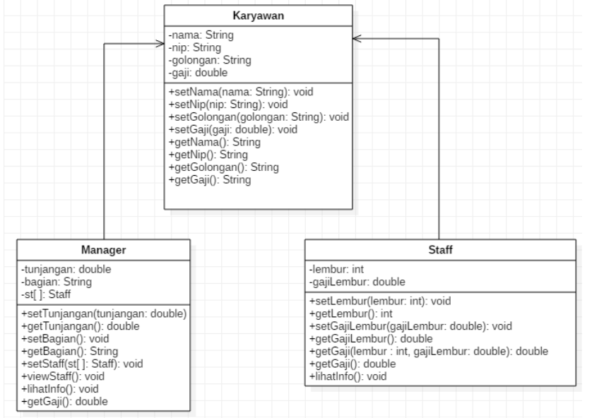
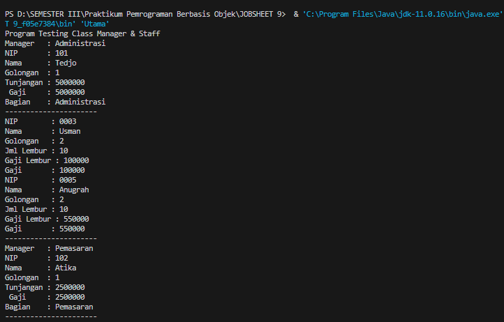
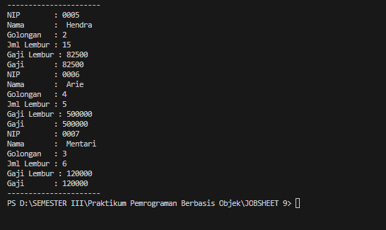
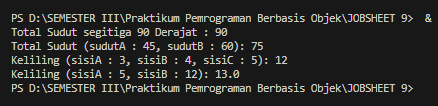

# JOBSHEET 9
Nama : Chyntia Santi Nur Trisnawati  
Kelas : 2C   
Absen : 08 (Delapan)  
NIM : 224172001

## Praktikum
3.1 Percobaan 1
Untuk kasus contoh berikut ini, terdapat tiga kelas, yaitu Karyawan, Manager, dan Staff.
Class Karyawan merupakan superclass dari Manager dan Staff dimana subclass Manager dan
Staff memiliki method untuk menghitung gaji yang berbeda.  
  
### 3.2 Karyawan  

```java 
public class Karyawan {
    private String nama;
    private String nip;
    private String golongan;
    private double gaji;

    public void setNama(String nama){
        this.nama = nama;
    }

    public void setNip(String nip){
        this.nip = nip;
    }

    public void setGolongan(String golongan){
        this.golongan = golongan;

        switch(golongan.length()){
            case '1':this.gaji = 5000000;
                break;
            case '2':this.gaji = 3000000;
                break;
            case '3':this.gaji = 2000000;
                break;
            case '4':this.gaji = 1000000;
                break;
            case '5': this.gaji = 750000;
                break;
        }
    }

    public void setGaji(double gaji){
        this.gaji = gaji;
    }

    public String getNama(){
        return nama;
    }
    
    public String getNip(){
        return nip;
    }

    public String getGolongan(){
        return golongan;
    }

    public double getGaji(){
        return gaji;
    }
}
```  
### 3.3 Staff
```java
public class Staff extends Karyawan{
    private int lembur;
    private double gajiLembur;

    public void setLembur(int lembur){
        this.lembur = lembur;
    }

    public int getLembur(){
        return lembur;
    }

    public void setGajiLembur(double gajiLembur){
        this.gajiLembur = gajiLembur;
    }

    public double getGajiLembur(){
        return gajiLembur;
    }

    // Overloading //
    public double getGaji(int lembur, double gajiLembur){
        return super.getGaji() + lembur*gajiLembur;
    }

    // Overriding //
    public double getGaji(){
        return super.getGaji() + lembur*gajiLembur;
    }

    public void lihatInfo(){
        System.out.println("NIP        : "+this.getNip());
        System.out.println("Nama       : " +this.getNama());
        System.out.println("Golongan   : "+this.getGolongan());
        System.out.println("Jml Lembur : " +this.getLembur());
        System.out.printf("Gaji Lembur : %.0f\n", this.getGaji());
        System.out.printf("Gaji       : %.0f\n", this.getGaji());

    }
}
```

### 3.4 Manager
```java
public class Manager extends Karyawan{
    private double tunjangan;
    private String bagian;
    private Staff st[];

    public void setTunjangan(double tunjangan){
        this.tunjangan = tunjangan;
    }

    public double getTunjangan(){
        return tunjangan;
    }

    public void setBagian(String bagian){
        this.bagian = bagian;
    }

    public String getBagian(){
        return bagian;
    }

    public void setStaff(Staff st[]){
        this.st = st;
    }

    public void viewStaff(){
        int i;
        System.out.println("----------------------");
        for(i=0; i<st.length; i++){
            st[i].lihatInfo();
        }

        System.out.println("----------------------");
    }

    public void lihatInfo(){
        System.out.println("Manager   : " +this.getBagian());
        System.out.println("NIP       : " +this.getNip());
        System.out.println("Nama      : " +this.getNama());
        System.out.println("Golongan  : "+this.getGolongan());
        System.out.printf("Tunjangan : %.0f\n ", this.getTunjangan());
        System.out.printf("Gaji     : %.0f\n",this.getGaji());
        System.out.println("Bagian    : "+this.getBagian());
        this.viewStaff();
    }

    public double getGaji(){
        return super.getGaji()+tunjangan;
    }
}
```

### Utama
```java
public class Utama {
    public static void main(String[] args) {
        System.out.println("Program Testing Class Manager & Staff");
        Manager man[] = new Manager[2];
        Staff staff1[] = new Staff[2];
        Staff staff2[] = new Staff[3];

        // Pembuatan Manager //
        man[0]= new Manager();
        man[0].setNama("Tedjo");
        man[0].setNip("101");
        man[0].setGolongan("1");
        man[0].setTunjangan(5000000);
        man[0].setBagian("Administrasi");

        man[1]= new Manager();
        man[1].setNama("Atika");
        man[1].setNip("102");
        man[1].setGolongan("1");
        man[1].setTunjangan(2500000);
        man[1].setBagian("Pemasaran");

        staff1[0] = new Staff();
        staff1[0].setNama("Usman");
        staff1[0].setNip("0003");
        staff1[0].setGolongan("2");
        staff1[0].setLembur(10);
        staff1[0].setGajiLembur(10000);

        staff1[1] = new Staff();
        staff1[1].setNama("Anugrah");
        staff1[1].setNip("0005");
        staff1[1].setGolongan("2");
        staff1[1].setLembur(10);
        staff1[1].setGajiLembur(55000);
        man[0].setStaff(staff1);

        staff2[0] = new Staff();
        staff2[0].setNama(" Hendra");
        staff2[0].setNip("0005");
        staff2[0].setGolongan("2");
        staff2[0].setLembur(15);
        staff2[0].setGajiLembur(5500);

        staff2[1] = new Staff();
        staff2[1].setNama(" Arie");
        staff2[1].setNip("0006");
        staff2[1].setGolongan("4");
        staff2[1].setLembur(5);
        staff2[1].setGajiLembur(100000);

        staff2[2] = new Staff();
        staff2[2].setNama(" Mentari");
        staff2[2].setNip("0007");
        staff2[2].setGolongan("3");
        staff2[2].setLembur(6);
        staff2[2].setGajiLembur(20000);
        man[1].setStaff(staff2);

        // Mencetak informasi dari manager + staff
        man[0].lihatInfo();
        man[1].lihatInfo();
    }
}
```




## Latihan

``` java
public class PerkalianKu {
    void perkalian(int a, int b){
        System.out.println(a * b);
    }

    void perkalian(int a, int b,int c){
        System.out.println(a * b * c);
    }

    public static void main(String[] args) {
        PerkalianKu objek = new PerkalianKu();

        objek.perkalian(25, 43);
        objek.perkalian(34, 23, 56);
    }
}
```
4.1 Dari source coding diatas terletak dimanakah overloading? 
Jawab :   
Overloading terjadi pada metode perkalian dalam class PerkalianKu. Overloading adalah ketika terdapat dua atau lebih metode dalam satu class dengan nama yang sama, tetapi jumlah atau tipe parameter berbeda.  

terdapat dua metode perkalian dengan nama yang sama, tetapi berbeda dalam jumlah parameter:

Metode pertama: void perkalian(int a, int b)
Metode kedua: void perkalian(int a, int b, int c)
Ini merupakan contoh overloading karena keduanya memiliki nama yang sama (perkalian), tetapi berbeda dalam jumlah parameter.

4.2 Jika terdapat overloading ada berapa jumlah parameter yang berbeda?  
Jawab :  
dua jumlah parameter yang berbeda:

Metode pertama memiliki dua parameter: void perkalian(int a, int b)
Metode kedua memiliki tiga parameter: void perkalian(int a, int b, int c)
Jadi, terdapat dua jumlah parameter yang berbeda dalam kasus ini.

 ```java 
 public class PerkalianKu {
    void perkalian(int a, int b){
        System.out.println(a * b);
    }

    void perkalian(double a, double b){
        System.out.println(a * b);
    }

    public static void main(String[] args) {
        PerkalianKu objek = new PerkalianKu();

        objek.perkalian(25, 43);
        objek.perkalian(34.56, 23.7);
    }
}
```

4.3 Dari source coding diatas terletak dimanakah overloading?  
Jawab  
  
 overloading pada metode perkalian yaitu sebagai berikut :

void perkalian(int a, int b): Menerima dua parameter bertipe int.
void perkalian(double a, double b): Menerima dua parameter bertipe double.

Kedua metode ini memiliki nama yang sama, tetapi parameter berbeda, baik dalam jumlah maupun tipe data. Oleh karena itu, ini adalah contoh overloading dalam Java.     

4.4 Jika terdapat overloading ada berapa tipe parameter yang berbeda?  
Jawab :   
ada dua tipe parameter yang berbeda:

Tipe parameter pertama: (int a, int b)
Tipe parameter kedua: (double a, double b)
Kedua metode ini memiliki tipe parameter yang berbeda, yaitu satu menggunakan tipe data int dan yang lainnya menggunakan tipe data double. Jadi, dalam hal ini, terdapat dua tipe parameter yang berbeda untuk metode overloading.

### Class Ikan 
```java
public class Ikan {
    public void swim(){
        System.out.println("Ikan bisa berenang");
    }
}
```

### Class Piranha
```java
public class Piranha extends Ikan{
    public void swim(){
        System.out.println("Piranha bisa makan daging");
    }
}
```

### Class Fish
```java
public class Fish {
    public static void main(String[] args) {
        Ikan a = new Ikan();
        Ikan b = new Piranha();
        a.swim();
        b.swim();
    }
}
```
Hasil ketika program dijalankan adalah sebagai berikut


4.5 Dari source coding diatas terletak dimanakah overriding?  
Jawab :  
Overriding terjadi ketika subclass (kelas turunan) menyediakan implementasi ulang terhadap metode yang sudah ada di superclass (kelas induk). dengan penjelasannya sebagai berikut :  
- Kelas Ikan memiliki metode swim yang mencetak bahwa "Ikan bisa berenang".
- Kelas Piranha merupakan turunan dari Ikan dan melakukan overriding pada metode swim, sehingga mencetak bahwa "Piranha bisa makan daging".
- Dalam metode main pada kelas Fish, objek a dibuat sebagai instance dari Ikan, dan objek b dibuat sebagai instance dari Piranha.
- Saat memanggil metode swim pada objek a, akan dipanggil implementasi dari swim di kelas Ikan.
- Saat memanggil metode swim pada objek b, akan dipanggil implementasi dari swim di kelas Piranha, meskipun tipe referensinya adalah Ikan. Ini adalah contoh overriding.   

4.6 Jabarkanlah apabila sourcoding diatas jika terdapat overriding?  
Jawab  :  
- Kelas Ikan memiliki metode swim yang mencetak bahwa "Ikan bisa berenang".
- Kelas Piranha merupakan turunan dari Ikan dan melakukan overriding pada metode swim, sehingga mencetak bahwa "Piranha bisa makan daging".
- Dalam metode main pada kelas Fish, objek a dibuat sebagai instance dari Ikan, dan objek b dibuat sebagai instance dari Piranha.
- Saat memanggil metode swim pada objek a, akan dipanggil implementasi dari swim di kelas Ikan.
- Saat memanggil metode swim pada objek b, akan dipanggil implementasi dari swim di kelas Piranha, meskipun tipe referensinya adalah Ikan. Ini adalah contoh overriding.        
## 5. Tugas
### 5.1 Overloading
Implementasikan konsep overloading pada class diagram dibawah ini :
  
Jawab : 
```java
public class Segitiga {
    private int sudut;

    public int totalSudut(int sudutA) {
        return 180 - sudutA;
    }

    public int totalSudut(int sudutA, int sudutB) {
        return 180 -(sudutA + sudutB);
    }

    public int keliling(int sisiA, int sisiB, int sisiC) {
        return sisiA + sisiB + sisiC;
    }

    public double keliling(int sisiA, int sisiB) {
        double c = Math.sqrt(Math.pow(sisiA, 2) + Math.pow(sisiB, 2));
        return c;
    }

    public static void main(String[] args) {
        Segitiga segitiga = new Segitiga();

        // Contoh pemanggilan metode totalSudut
        int hasilSudut1 = segitiga.totalSudut(90);
        System.out.println("Total Sudut segitiga 90 Derajat : " + hasilSudut1);

        int hasilSudut2 = segitiga.totalSudut(45, 60);
        System.out.println("Total Sudut (sudutA : 45, sudutB : 60): " + hasilSudut2);

        // Contoh pemanggilan metode keliling
        int hasilKeliling1 = segitiga.keliling(3, 4, 5);
        System.out.println("Keliling (sisiA : 3, sisiB : 4, sisiC : 5): " + hasilKeliling1);

        double hasilKeliling2 = segitiga.keliling(5, 12);
        System.out.println("Keliling (sisiA : 5, sisiB : 12): " + hasilKeliling2);
    }
}

```
Hasil ketika dijalankan adalah sebagai berikut   
  
## 5.2 Overriding
Implementasikan class diagram dibawah ini dengan menggunakan teknik dynamic
method dispatch :  
  
Jawab :  
### Manusia
```java
public class Manusia {
    public void bernafas(){
        System.out.println("Dapat Bernafas");
    }

    public void makan(){
        System.out.println("Dapat Makan");
    }
}
```

### Dosen
```java
public class Dosen extends Manusia {
    public void makan(){
        System.out.println("Dosen Bisa Makan");
    }

    public void lembur(){
        System.out.println("Dosen Lembur");
    }
}
```

### Mahasiswa
```java
public class Mahasiswa extends Manusia {
    public void makan(){
        System.out.println("Mahasiswa Dapat Makan");
    }
    
    public void tidur(){
        System.out.println("Mahasiswa Tidur");
    }
}
```
Hasil ketika dijalakan adalah sebagai berikut : 

