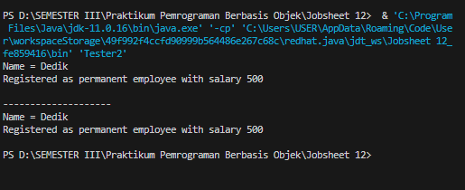

Nama : Chyntia Santi Nur Trisnawati   
Kelas : 2-C   
Absen : 08 (Delapan)   
NIM : 2241720017

## Studi Kasus 
Untuk percobaan pada jobsheet ini akan digunakan class diagram di bawah
ini:  
   
Dalam suatu perusahaan, pemilik pada tiap bulannya harus membayar gaji
pegawai tetap dan rekening listrik. Selain pegawai tetap perusahaan juga
memiliki pegawai magang, dimana pegawai ini tidak mendapatkan gaji.  
## Percobaan 1 – Bentuk dasar polimorfisme  
### Langkah Percobaan
1. Buat class Employee  
```java 
public class Employee {
    protected String name;

    public String getEmployeeInfo() {
        return "Name = " + name;
    }
}
```
2. Buat interface Payable  
```java
public class Employee {
    protected String name;

    public String getEmployeeInfo() {
        return "Name = " + name;
    }
}
```
3. Buat class InternshipEmployee, subclass dari Employee
```java
public class InternshipEmployee extends Employee {
    private int length;

    public InternshipEmployee(String name, int length){
        this.length = length;
        this.name = name;
    }

    public int getLength(){
        return length;
    }

    public void setLength(int length){
        this.length = length;
    }

    @Override
    public String getEmployeeInfo(){
        String info = super.getEmployeeInfo()+"\n";
        info += "Registered as internship employee for "+length+ "month/s\n";
        return info;
    }
}
```
 Buat class PermanentEmployee, subclass dari Employee dan
implements ke Payable
```java
public class PermanentEmployee extends Employee implements Payable{
    private int salary;

    public PermanentEmployee(String name, int salary) {
        this.name = name;
        this.salary = salary;
    }

    public int getSalary(){
        return salary;
    }

    public void setSalary(int salary){
        this.salary = salary;
    }

    @Override
    public int getPaymentAmount(){
        return (int) (salary+0.05*salary);
    }

    @Override
    public String getEmployeeInfo(){
        String info = super.getEmployeeInfo()+"\n";
        info += "Registered as permanent employee with salary "+salary+ "\n";
        return info;
    }
}```

5. Buat class ElectricityBill yang implements ke interface
Payable
```java

public class ElectricityBill implements Payable{
    private int kwh;
    private String category;
    
    public ElectricityBill(int kwh, String category){
        this.kwh = kwh;
        this.category = category;
    }

    public int getKwh(){
        return kwh;
    }

    public void setKwh(int kwh){
        this.kwh = kwh;
    }

    public String getCategory() {
        return category;
    }

    public void setCategory(String category){
        this.category = category;
    }

    @Override
    public int getPaymentAmount(){
        return kwh*getBasePrice();
    }

    public int getBasePrice(){
        int bPrice = 0;
        switch (category) {
            case "R-1": bPrice = 100;                
                break;
            case "R-2": bPrice = 200;
                break;
        }
        return bPrice;
    }

    public String getBillInfo(){
        return "kWH = " + kwh + "\n" +
        "Category = " + category +"(" +getBasePrice() + "per kWH)\n";
    }
}
```
Buat class Tester1  
```java
public class Tester1 {
    public static void main(String[] args) {
        PermanentEmployee pEmp = new PermanentEmployee("Dedik", 500);
        InternshipEmployee iEmp = new InternshipEmployee("Sunarto", 5);
        ElectricityBill eBill = new ElectricityBill(5, "A-1");
        Employee e;
        Payable p;
        e = pEmp;
        e = iEmp;
        p = pEmp;
        p = eBill;
    }
}
```
## Pertanyaan
1. Class apa sajakah yang merupakan turunan dari class Employee?   
Jawab    
a. class InternshipEmployee   
b. class PermanentEmployee  

2. Class apa sajakah yang implements ke interface Payable?   
Jawab  
a. class ElectricityBill   
b. class InternshipEmployee  

3. Perhatikan class Tester1, baris ke-10 dan 11. Mengapa e, bisa diisi
dengan objek pEmp (merupakan objek dari class PermanentEmployee)
dan objek iEmp (merupakan objek dari class
InternshipEmploye) ?     
Jawab   
a. Variabel e (Employee):

Karena PermanentEmployee dan InternshipEmployee adalah kelas turunan dari Employee, objek dari kedua kelas tersebut dapat diassign ke variabel dengan tipe data Employee.
Hal ini memanfaatkan hubungan "is-a" dalam pemrograman berorientasi objek, di mana objek dari subclass dapat dianggap sebagai objek dari superclass.    

b. Pemanggilan Metode getEmployeeInfo():

Ketika variabel e dipanggil dengan metode getEmployeeInfo(), metode yang dijalankan sesuai dengan jenis objek yang sebenarnya disimpan dalam variabel tersebut. Jadi, jika e berisi objek PermanentEmployee, metode getEmployeeInfo() dari PermanentEmployee yang dijalankan. Begitu pula jika e berisi objek InternshipEmployee.  

4. Perhatikan class Tester1, baris ke-12 dan 13. Mengapa p, bisa diisi
denganobjekpEmp (merupakan objek dari class
PermanentEmployee) dan objek eBill (merupakan objek dari class
ElectricityBill) ?    
Jawab   
Baris ke-12 dan ke-13 juga menggunakan konsep polimorfisme. Variabel p adalah variabel dengan tipe data Payable, yang merupakan sebuah antarmuka (interface) yang diimplementasikan oleh PermanentEmployee dan ElectricityBill. Oleh karena itu, objek dari keduanya dapat diassign ke variabel dengan tipe data Payable.   

5. Coba tambahkan sintaks:
p = iEmp;
e = eBill;
pada baris 14 dan 15 (baris terakhir dalam method main) ! Apa yang
menyebabkan error?   
Jawab   
a. Baris 14 (p = iEmp) akan menyebabkan error kompilasi. Hal ini karena InternshipEmployee tidak mengimplementasikan antarmuka Payable, dan variabel p memiliki tipe data Payable. Sehingga, objek dari InternshipEmployee tidak dapat diassign ke variabel dengan tipe data Payable.  

b. Baris 15 (e = eBill) tidak akan menyebabkan error kompilasi. Ini karena ElectricityBill mengimplementasikan antarmuka Payable, dan variabel e memiliki tipe data Employee, yang dapat merujuk pada objek yang mengimplementasikan antarmuka Payable. Sehingga, objek dari ElectricityBill dapat diassign ke variabel dengan tipe data Employee yang kemudian di-cast ke Payable.  

6. Ambil kesimpulan tentang konsep/bentuk dasar polimorfisme!  
Jawab   

Polimorfisme, dalam konteks pemrograman berorientasi objek, memungkinkan objek dari kelas yang berbeda untuk diakses melalui antarmuka umum. Dengan konsep ini, variabel dapat merujuk pada objek dengan tipe yang lebih umum, meningkatkan fleksibilitas dan reusabilitas kode secara dinamis.
## Percobaan 2 – Virtual method invocation
# Langkah Percobaan
1. Pada percobaan ini masih akan digunakan class-class dan interface yang
digunakan pada percobaan sebelumnya.
2. Buat class baru dengan nama Tester2
```java
public class Tester2 {
    public static void main(String[] args) {
        PermanentEmployee pEmp = new PermanentEmployee("Dedik", 500);
        Employee e;
        e = pEmp;
        System.out.println("" +e.getEmployeeInfo());
        System.out.println("--------------------");
        System.out.println("" +pEmp.getEmployeeInfo());
    }
}
```
Jalankan class Tester2, dan akan didapatkan hasil sebagai berikut:  

## 5.2. Pertanyaan  
1. Perhatikan class Tester2 di atas, mengapa pemanggilan
e.getEmployeeInfo() pada baris 8 dan
pEmp.getEmployeeInfo() pada baris 10 menghasilkan hasil sama?   
Jawab :   
Pada class Tester2, pemanggilan e.getEmployeeInfo() pada baris 8 dan pEmp.getEmployeeInfo() pada baris 10 menghasilkan hasil yang sama karena variabel e adalah variabel dengan tipe data Employee, tetapi merujuk pada objek yang sebenarnya adalah instance dari kelas PermanentEmployee.  

2. Mengapa pemanggilan method e.getEmployeeInfo() disebut sebagai
pemanggilan method virtual (virtual method invication), sedangkan
pEmp.getEmployeeInfo() tidak?   
Jawab :  
Pemanggilan e.getEmployeeInfo() disebut "pemanggilan metode virtual" atau "virtual method invocation" karena variabel e memiliki tipe data Employee, yang merupakan kelas induk dari PermanentEmployee. Dalam polimorfisme, metode yang dipanggil diresolusi pada saat runtime sesuai dengan objek sebenarnya yang dirujuk oleh variabel. Oleh karena itu, meskipun variabelnya bertipe Employee, JVM akan menemukan dan menjalankan implementasi metode yang sebenarnya tergantung pada objek yang sedang diakses.  

3. Jadi apakah yang dimaksud dari virtual method invocation? Mengapa
disebut virtual?  
Jawab :  
Virtual Method Invocation (VMI) mengacu pada konsep di pemrograman berorientasi objek di mana metode yang dipanggil pada saat runtime ditentukan oleh jenis objek sebenarnya, bukan oleh jenis referensi variabel yang digunakan untuk mengakses objek tersebut. Konsep ini memungkinkan polimorfisme, di mana objek dari kelas yang berbeda dapat diakses melalui antarmuka umum atau superclass.

## Percobaan 3 – Heterogenous Collection 
### Langkah Percobaan  
1. Pada percobaan ke-3 ini, masih akan digunakan class-class dan interface
pada percobaan sebelumnya.
2. Buat class baru Tester3   
```java
public class Tester3 {
    public static void main(String[] args) {
        PermanentEmployee pEmp = new PermanentEmployee("Dedik", 500);
        InternshipEmployee iEmp =  new InternshipEmployee(("Sunarto"), 5);
        ElectricityBill eBill = new ElectricityBill(5, "A-1");
        Employee e[] = {pEmp, iEmp};
        Payable p[] = {pEmp, eBill};
        Employee e2[] = {pEmp, iEmp, eBill};
    }
}
```
## 6.2. Pertanyaan  
1. Perhatikan array e pada baris ke-8, mengapa ia bisa diisi dengan objekobjek dengan tipe yang berbeda, yaitu objek pEmp (objek dari
PermanentEmployee) dan objek iEmp (objek dari
InternshipEmployee) ?   
Jawab :  
Pada kelas Tester3, kita membuat beberapa objek dari kelas yang berbeda, yaitu PermanentEmployee, InternshipEmployee, dan ElectricityBill. Selanjutnya, Anda membuat array dari tipe data Employee, Payable, dan kombinasi keduanya untuk menunjukkan penggunaan polimorfisme dalam konteks array.  

2. Perhatikan juga baris ke-9, mengapa array p juga biisi dengan objek-objek
dengan tipe yang berbeda, yaitu objek pEmp (objek dari
PermanentEmployee) dan objek eBill (objek dari
ElectricityBilling) ?  
Jawab :   
Pada baris ke-9, array p dideklarasikan sebagai array dari tipe data Payable dan diisi dengan objek pEmp (objek dari PermanentEmployee) dan objek eBill (objek dari ElectricityBilling). Hal ini memungkinkan karena keduanya mengimplementasikan antarmuka Payable.

Dalam pemrograman berorientasi objek, ketika suatu kelas mengimplementasikan sebuah antarmuka, objek dari kelas tersebut dapat dianggap sebagai objek dari antarmuka tersebut. Oleh karena itu, baik PermanentEmployee maupun ElectricityBilling dapat dianggap sebagai objek dari antarmuka Payable.  

3. Perhatikan baris ke-10, mengapa terjadi error?  
Jawab :  
Karena Type yang dimaksud tidak dapat dapat di convert dari ElectricityBill to Employee

## Percobaan 4 – Argumen polimorfisme, instanceof dan casting objek 
###  Langkah Percobaan  

1. Percobaan 4 ini juga masih menggunakan class-class dan interface yang
digunakan pada percobaan sebelumnya.
4. Buat class baru dengan nama Owner. Owner bisa melakukan
pembayaran baik kepada pegawai permanen maupun rekening listrik
melalui method pay(). Selain itu juga bisa menampilkan info pegawai
permanen maupun pegawai magang melalui method
showMyEmployee()  

```java
public class Owner {
    public void pay(Payable p){
        System.out.println("Total payment = " +p.getPaymentAmount());
        if(p instanceof ElectricityBill){
            ElectricityBill eb = (ElectricityBill) p;
            System.out.println("" + eb.getBillInfo());
        } else if(p instanceof PermanentEmployee){
            PermanentEmployee pe = (PermanentEmployee) p;
            pe.getEmployeeInfo();
            System.out.println(""+pe.getEmployeeInfo());
        }
    }
    public void showEmployee(Employee e){
        System.out.println(""+e.getEmployeeInfo());
        if(e instanceof PermanentEmployee){
            System.out.println("Yoy have to pay her/him monthly!!!");
        } else {
            System.out.println("No need to pay him/her : ");
        }
    }
}
```
Buat class baru Tester4
```java
public class Tester4 {
    public static void main(String[] args) {
        Owner ow = new Owner();
        ElectricityBill eBill = new ElectricityBill(5, "R-1");
        ow.pay(eBill); // Pay For Electricity bill
        System.out.println("-------------------------------------------------");

        PermanentEmployee pEmp = new PermanentEmployee("Dedik", 500);
        ow.pay(pEmp); // Pay for permanent employee
        System.out.println("-------------------------------------------------");

        InternshipEmployee iEmp = new InternshipEmployee("Sunarto", 5);
        ow.showEmployee(iEmp); // Show permanent employee info
        System.out.println("-------------------------------------------------");
        ow.showEmployee(iEmp); // Show Intership employee info
    }
}
```
Jalankan class Tester4, dan akan didaptkan hasil sebagai beriku

## Pertanyaan 
1. Perhatikan class Tester4 baris ke-7 dan baris ke-11, mengapa
pemanggilan ow.pay(eBill) dan ow.pay(pEmp) bisa dilakukan,
padahal jika diperhatikan method pay() yang ada di dalam class Owner
memiliki argument/parameter bertipe Payable?    
Jika diperhatikan lebih detil eBill merupakan objek dari
ElectricityBill dan pEmp merupakan objek dari
PermanentEmployee?   
Jawab :   
Pemanggilan ow.pay(eBill) dan ow.pay(pEmp) dapat dilakukan karena kedua kelas ElectricityBill dan PermanentEmployee mengimplementasikan antarmuka Payable. Dalam Java, sebuah kelas dapat mengimplementasikan satu atau lebih antarmuka, dan objek dari kelas tersebut dapat digunakan di mana pun antarmuka tersebut diharapkan.

Dalam konteks ini, antarmuka Payable mungkin memiliki metode pay(), dan kelas ElectricityBill dan PermanentEmployee harus memberikan implementasi untuk metode ini karena keduanya mengimplementasikan antarmuka tersebut.  

2. Jadi apakah tujuan membuat argument bertipe Payable pada method
pay() yang ada di dalam class Owner?   
Jawab :   
Membuat argumen bertipe Payable pada metode pay() di dalam kelas Owner menunjukkan penggunaan polimorfisme dalam pemrograman berorientasi objek. Dengan menggunakan antarmuka atau kelas dasar bersama seperti Payable, dapat mengelola objek dari berbagai kelas yang mengimplementasikan antarmuka tersebut tanpa perlu tahu jenis spesifik dari setiap objek. Tujuan utama dari ini adalah meningkatkan fleksibilitas dan kemampuan untuk bekerja dengan berbagai jenis objek yang dapat "dibayar".    

3. Coba pada baris terakhir method main() yang ada di dalam class
Tester4 ditambahkan perintah ow.pay(iEmp);   
Jawab :   
```java 
public class Tester4 {
    public static void main(String[] args) {
        Owner ow = new Owner();
        ElectricityBill eBill = new ElectricityBill(5, "R-1");
        ow.pay(eBill); // Pay For Electricity bill
        System.out.println("-------------------------------------------------");

        PermanentEmployee pEmp = new PermanentEmployee("Dedik", 500);
        ow.pay(pEmp); // Pay for permanent employee
        System.out.println("-------------------------------------------------");

        InternshipEmployee iEmp = new InternshipEmployee("Sunarto", 5);
        ow.showEmployee(iEmp); // Show permanent employee info
        System.out.println("-------------------------------------------------");
        ow.showEmployee(iEmp); // Show Intership employee info

        ow.pay(iEmp);
    }
}
```
Mengapa terjadi error?
kelas InternshipEmployee tidak mengimplementasikan antarmuka Payable. Oleh karena itu, jika metode pay di kelas Owner memiliki parameter bertipe Payable, Anda tidak dapat langsung memanggilnya dengan objek InternshipEmployee.   

4. Perhatikan class Owner, diperlukan untuk apakah sintaks p
instanceof ElectricityBill pada baris ke-6 ?   
Jawab :   
Penggunaan sintaks instanceof pada baris ke-6 di dalam metode pay dalam kelas Owner adalah untuk memeriksa apakah objek yang diterima sebagai parameter adalah instance dari kelas ElectricityBill.  

5. Perhatikan kembali class Owner baris ke-7, untuk apakah casting objek
disana (ElectricityBill eb = (ElectricityBill) p)
diperlukan ? Mengapa objek p yang bertipe Payable harus di-casting ke
dalam objek eb yang bertipe ElectricityBill ?   
Jawab :  
Casting objek pada baris ke-7 dari metode pay dalam kelas Owner diperlukan karena parameter p di deklarasikan dengan tipe Payable, dan kita ingin mengakses metode atau properti yang spesifik untuk kelas ElectricityBill yang tidak ada di antarmuka Payable.  

## Tugas
Dalam suatu permainan, Zombie dan Barrier bisa dihancurkan oleh Plant dan
bisa menyembuhkan diri. Terdapat dua jenis Zombie, yaitu Walking Zombie dan
Jumping Zombie. Kedua Zombie tersebut memiliki cara penyembuhan yang
berbeda, demikian juga cara penghancurannya, yaitu ditentukan oleh aturan
berikut ini:  

• Pada WalkingZombie  
a. Penyembuhan : Penyembuhan ditentukan berdasar level zombie
yang bersangkutan
- Jika zombie level 1, maka setiap kali penyembuhan, health
akan bertambah 10%  
- Jika zombie level 2, maka setiap kali penyembuhan, health
akan bertambah 30%   
- Jika zombie level 3, maka setiap kali penyembuhan, health
akan bertambah 40%  
Penghancuran : setiap kali penghancuran, health akan berkurang
2%  

b. Pada Jumping Zombie  
Penyembuhan : Penyembuhan ditentukan berdasar level zombie
yang bersangkutan   
- Jika zombie level 1, maka setiap kali penyembuhan, health
akan bertambah 30%   
- Jika zombie level 2, maka setiap kali penyembuhan, health
akan bertambah 40%  
- Jika zombie level 3, maka setiap kali penyembuhan, health
akan bertambah 50%  
Penghancuran : setiap kali penghancuran, health akan berkurang
1%
Buat program dari class diagram di bawah ini!


Class Zombie  
```java
public class Zombie implements Destroyable {
    // Atribut Zombie
    private int health;
    private int level;

     // Konstruktor Zombie
     public Zombie(int health, int level) {
        this.health = health;
        this.level = level;
    }

    public void setHealth(int health) {
        this.health = health;
    }

    public void heal() {
        
    }
    
    public void destroyed() {
        // Implementasi untuk menandai Zombie sebagai hancur
        // Misalnya, mengatur level menjadi 0
        level = 0;
    }

    // Metode untuk mendapatkan informasi Zombie
    public String getZombieInfo() {
        return  "\n Health: " + health + ", \n Level: " + level;
    }
}

```
Class Walking zombie
```java
public class WalkingZombie extends Zombie {
    // Konstruktor WalkingZombie
    public WalkingZombie(int health, int level) {
        super(health, level); // Memanggil konstruktor kelas Zombie
    }

    // Implementasi metode heal khusus untuk WalkingZombie
    @Override
    public void heal() {
    }

    // Implementasi metode destroyed khusus untuk WalkingZombie
    @Override
    public void destroyed() {
        // Implementasi untuk menandai bahwa WalkingZombie telah hancur
        // Misalnya, mengatur level menjadi 0
        super.destroyed(); // Memanggil metode destroyed dari kelas Zombie
    }

    // Implementasi metode getZombieInfo khusus untuk WalkingZombie
    @Override
    public String getZombieInfo() {
        // Implementasi untuk mendapatkan informasi WalkingZombie
        // ...
        return "Walking Zombie Data"+super.getZombieInfo(); // Memanggil metode getZombieInfo dari kelas Zombie
    }

}
```

Class JumpingZombie
```java
public class JumpingZombie extends Zombie {
    public JumpingZombie(int health, int level){
        super(health, level);
    }

    @Override
    public void heal() {
    }

    // Implementasi metode destroyed khusus untuk WalkingZombie
    @Override
    public void destroyed() {
        // Implementasi untuk menandai bahwa WalkingZombie telah hancur
        // Misalnya, mengatur level menjadi 0
        super.destroyed(); // Memanggil metode destroyed dari kelas Zombie
    }

    // Implementasi metode getZombieInfo khusus untuk WalkingZombie
    @Override
    public String getZombieInfo() {
        // Implementasi untuk mendapatkan informasi WalkingZombie
        // ...
        return "Jumping Zombie Data " + super.getZombieInfo(); // Memanggil metode getZombieInfo dari kelas Zombie
    }
    
}
```

Class Destroyable
```java
public interface Destroyable {
    public void destroyed();  
}
```

Class Barrier
```java
public class Barrier implements Destroyable {
    private int strength;

    public Barrier(int strength) {
        this.strength = strength;
    }

    public void setStrength(int strength) {
        this.strength = strength;
    }

    public int getStrength() {
        return strength;
    }

    @Override
    public void destroyed() {
        // Implement the destruction logic here
        System.out.println("Barrier destroyed!");
    }

    public String getBarrierInfo() {
        return "Barrier Strength: " + strength;
    }
}
```
Class Plant
```java 
public class Plant {
    public void doDestroy(Destroyable destroyable) {
        if (destroyable instanceof WalkingZombie) {
            WalkingZombie walkingZombie = (WalkingZombie) destroyable;
            // Memperbarui kesehatan WalkingZombie
            walkingZombie.setHealth(42);
            // Aksi tambahan jika diperlukan
        } else if (destroyable instanceof JumpingZombie) {
            JumpingZombie jumpingZombie = (JumpingZombie) destroyable;
            // Memperbarui kesehatan JumpingZombie
            jumpingZombie.setHealth(66);
            // Aksi tambahan jika diperlukan
        } else if (destroyable instanceof Barrier) {
            // Kode khusus untuk menghancurkan Barrier
            Barrier barrier = (Barrier) destroyable;

            barrier.setStrength(64);
            // Aksi tambahan jika diperlukan
        } else {
            // Mengatasi kasus lain atau memberikan perilaku default
            System.out.println("Jenis Destroyable tidak didukung");
        }
    }
}
```

Hasil Ketika dijalankan adalag sebagai berikut
