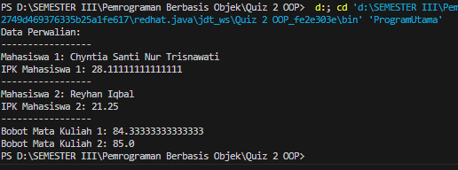

# QUIZ 2 Pemrograman Berorientasi Object

## 1. Kelas Mahasiswa:

• Buat kelas Mahasiswa dengan atribut nama, nim, dan nilai.  
• Implementasikan metode hitung_ipk untuk menghitung IPK berdasarkan nilai.  
• Overload metode hitung_ipk dengan versi baru yang menerima parameter nilai_sks. Metode ini digunakan untuk menghitung IPK dengan memberikan bobot tertentu pada setiap mata kuliah.

```java
public class Mahasiswa {
    private String nama;
    private String nim;
    private double[] nilai;

    // Konstruktor
    public Mahasiswa(String nama, String nim, double[] nilai) {
        this.nama = nama;
        this.nim = nim;
        this.nilai = nilai;
    }

    // Hitung IPK berdasarkan nilai
    public double hitungIPK() {
        if (nilai.length == 0) {
            return 0.0;
        }

        double totalNilai = 0;
        for (double nilaiMataKuliah : nilai) {
            totalNilai += nilaiMataKuliah;
        }

        return totalNilai / nilai.length;
    }

    // Overload Hitung IPK dengan versi baru yang menerima parameter nilaiSKS
    public double hitungIPK(double[] nilaiSKS) {
        if (nilai.length != nilaiSKS.length) {
            System.out.println("Jumlah nilai dan nilai SKS tidak sesuai.");
            return 0.0;
        }

        double totalBobot = 0;
        double totalSKS = 0;

        for (int i = 0; i < nilai.length; i++) {
            totalBobot += nilai[i] * nilaiSKS[i];
            totalSKS += nilaiSKS[i];
        }

        if (totalSKS == 0) {
            return 0.0;
        } else {
            return totalBobot / totalSKS;
        }
    }
}
```

## 2. Kelas MataKuliah:

• Buat kelas MataKuliah dengan atribut nama_matakuliah, sks, dan nilai_mahasiswa.  
• Implementasikan metode hitung_bobot untuk menghitung bobot mata kuliah
berdasarkan nilai mahasiswa.  
• Overload metode hitung_bobot dengan versi baru yang menerima parameter
bobot_mahasiswa. Metode ini digunakan untuk menghitung bobot mata kuliah
dengan memberikan bobot berdasarkan nilai mahasiswa yang mengambil mata
kuliah tersebut.

```java
public class MataKuliah {
    private String namaMataKuliah;
    private int sks;
    private double[] nilaiMahasiswa;
    private int jumlahMahasiswa;

    // Konstruktor
    public MataKuliah(String namaMataKuliah, int sks, int maxMahasiswa) {
        this.namaMataKuliah = namaMataKuliah;
        this.sks = sks;
        this.nilaiMahasiswa = new double[maxMahasiswa];
        this.jumlahMahasiswa = 0;
    }

    // Getter dan Setter untuk Nama Mata Kuliah
    public String getNamaMataKuliah() {
        return namaMataKuliah;
    }

    public void setNamaMataKuliah(String namaMataKuliah) {
        this.namaMataKuliah = namaMataKuliah;
    }

    // Getter dan Setter untuk SKS
    public int getSks() {
        return sks;
    }

    public void setSks(int sks) {
        this.sks = sks;
    }

    // Getter dan Setter untuk Nilai Mahasiswa
    public double[] getNilaiMahasiswa() {
        return nilaiMahasiswa;
    }

    public void setNilaiMahasiswa(double[] nilaiMahasiswa) {
        this.nilaiMahasiswa = nilaiMahasiswa;
    }

    // Getter dan Setter untuk Jumlah Mahasiswa
    public int getJumlahMahasiswa() {
        return jumlahMahasiswa;
    }

    public void setJumlahMahasiswa(int jumlahMahasiswa) {
        this.jumlahMahasiswa = jumlahMahasiswa;
    }

    // Metode untuk menambahkan nilai mahasiswa
    public void tambahNilaiMahasiswa(double nilai) {
        if (jumlahMahasiswa < nilaiMahasiswa.length) {
            this.nilaiMahasiswa[jumlahMahasiswa] = nilai;
            jumlahMahasiswa++;
        } else {
            System.out.println("Batas maksimum mahasiswa untuk mata kuliah ini telah tercapai.");
        }
    }

    // Metode hitung bobot mata kuliah berdasarkan nilai mahasiswa
    public double hitungBobot() {
        if (jumlahMahasiswa == 0) {
            return 0.0;
        }

        double totalNilai = 0;
        for (int i = 0; i < jumlahMahasiswa; i++) {
            totalNilai += nilaiMahasiswa[i];
        }

        return totalNilai / jumlahMahasiswa;
    }

    // Overload metode hitung bobot dengan versi baru yang menerima parameter bobot mahasiswa
    public double hitungBobot(double[] bobotMahasiswa) {
        if (jumlahMahasiswa != bobotMahasiswa.length) {
            System.out.println("Jumlah nilai dan bobot mahasiswa tidak sesuai.");
            return 0.0;
        }

        double totalBobot = 0;
        for (int i = 0; i < jumlahMahasiswa; i++) {
            totalBobot += nilaiMahasiswa[i] * bobotMahasiswa[i];
        }

        return totalBobot / jumlahMahasiswa;
    }

    // Metode untuk representasi string objek
    @Override
    public String toString() {
        return "MataKuliah [namaMataKuliah=" + namaMataKuliah + ", sks=" + sks + "]";
    }
}
```

## Kelas Perwalian:

• Buat kelas Perwalian yang mengelola data mahasiswa dan mata kuliah yang
diambil.  
• Tambahkan metode untuk menambahkan mahasiswa ke dalam perwalian.  
• Tambahkan metode untuk menambahkan mata kuliah yang diambil oleh
mahasiswa.  
• Tambahkan metode untuk mencetak seluruh data mahasiswa beserta mata
kuliah yang diambil

```java
public class MahasiswaPerwalian extends Mahasiswa {
    private MataKuliah[] mataKuliahArray;
    private int jumlahMataKuliah;

    public MahasiswaPerwalian(String nama, String nim, double[] nilai, int maxMataKuliah) {
        super(nama, nim, nilai);
        this.mataKuliahArray = new MataKuliah[maxMataKuliah];
        this.jumlahMataKuliah = 0;
    }

    public void tambahMataKuliah(MataKuliah mataKuliah) {
        if (jumlahMataKuliah < mataKuliahArray.length) {
            mataKuliahArray[jumlahMataKuliah] = mataKuliah;
            jumlahMataKuliah++;
        } else {
            System.out.println("Batas maksimum mata kuliah dalam perwalian telah tercapai.");
        }
    }

    @Override
    public double hitungIPK() {
        if (jumlahMataKuliah == 0) {
            return super.hitungIPK();
        }

        double totalBobot = 0;
        double totalSKS = 0;

        for (int i = 0; i < jumlahMataKuliah; i++) {
            totalBobot += mataKuliahArray[i].hitungBobot();
            totalSKS += mataKuliahArray[i].getSks();
        }

        if (totalSKS == 0) {
            return super.hitungIPK();
        } else {
            return totalBobot / totalSKS;
        }
    }

    @Override
    public String toString() {
        return "MahasiswaPerwalian [nama=" + getNama() + ", nim=" + getNim() + "]";
    }
}
```

## Program Utama:

• Buat program utama yang menggunakan ketiga kelas tersebut.  
• Tambahkan beberapa objek mahasiswa dan mata kuliah.  
• Simulasikan proses perwalian, dengan menambahkan mahasiswa dan mata
kuliah yang diambil.  
• Cetak hasil perwalian, termasuk IPK masing-masing mahasiswa dan bobot mata
kuliah yang diambil.

```java
public class ProgramUtama {
    public static void main(String[] args) {
        // Membuat objek mahasiswa perwalian
        MahasiswaPerwalian mahasiswa1 = new MahasiswaPerwalian("Chyntia Santi Nur Trisnawati", "123456", new double[]{80, 85, 90}, 5);
        MahasiswaPerwalian mahasiswa2 = new MahasiswaPerwalian("Reyhan Iqbal", "789012", new double[]{75, 88, 92}, 5);

        // Membuat objek mata kuliah
        MataKuliah mataKuliah1 = new MataKuliah("Pemrograman Java", 3, 10);
        MataKuliah mataKuliah2 = new MataKuliah("Basis Data", 4, 10);

        // Menambahkan mahasiswa dan mata kuliah ke perwalian
        mahasiswa1.tambahMataKuliah(mataKuliah1);
        mahasiswa2.tambahMataKuliah(mataKuliah2);

        // Menambahkan nilai mahasiswa ke objek mata kuliah
        mataKuliah1.tambahNilaiMahasiswa(75);
        mataKuliah1.tambahNilaiMahasiswa(88);
        mataKuliah1.tambahNilaiMahasiswa(90);

        mataKuliah2.tambahNilaiMahasiswa(85);
        mataKuliah2.tambahNilaiMahasiswa(78);
        mataKuliah2.tambahNilaiMahasiswa(92);

        // Cetak hasil perwalian
        System.out.println("Data Perwalian:");
        System.out.println("-----------------");

        System.out.println("Mahasiswa 1: " + mahasiswa1.getNama());
        System.out.println("IPK Mahasiswa 1: " + mahasiswa1.hitungIPK());
        System.out.println("-----------------");

        System.out.println("Mahasiswa 2: " + mahasiswa2.getNama());
        System.out.println("IPK Mahasiswa 2: " + mahasiswa2.hitungIPK());
        System.out.println("-----------------");

        System.out.println("Bobot Mata Kuliah 1: " + mataKuliah1.hitungBobot());
        System.out.println("Bobot Mata Kuliah 2: " + mataKuliah2.hitungBobot());
    }
}
```

Hasil ketika dijalankan


