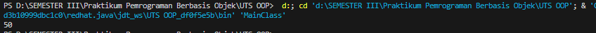
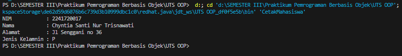
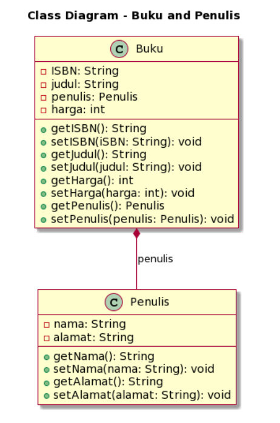
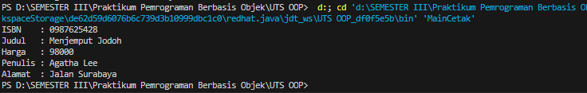

# UTS
Nama : Chyntia Santi Nur Trisnawati    
Kelas : 2C   
Absen : 08 (Delapan)  
NIM  : 2241720017

### Soal 1: Penulisan Class
Berdasarkan contoh class ClassA di bawah ini, jelaskan apakah penulisan source code pada contoh
class tersebut sudah benar. Jika tidak, apa yang perlu diperbaiki?
```java
public class ClassA {
    float f1 = 0.15f;
    float hitung() {
        float x = 2f * f1;
    }
}
```

Jawab:  
Kode program tersebut belum benar. Ada beberapa yang perlu di ubah yaitu sebagai berikut :  
1. Metode hitung() tidak mengembalikan nilai. Seharusnya metode ini harus mengembalikan nilai dengan tipe data float, sesuai dengan deklarasi return type-nya. Perbaiki kode tersebut dengan menambahkan pernyataan return untuk mengembalikan nilai x
2. Tidak memiliki konstruktor untuk kelas ClassA. sehingga perlu ditambahkan menambahkan konstruktor kosong (tanpa parameter) 
```java
public class ClassA {
    float f1 = 0.15f;
    
    public ClassA() {
        // Konstruktor kosong
    }
    
    float hitung() {
        float x = 2f * f1;
        return x;
    }
}
```

### Soal 2: Perhitungan Jumlah Elemen Array 2 Dimensi
Pada class SoalArray1, terdapat array 2 dimensi dengan ukuran 3x3. Tuliskan code Java untuk
menghitung jumlah total elemen array tersebut dengan menggunakan perulangan.
```java
public class SoalArray1 {
    public static void main(String[] args) {
        int[][] arrayInt = {{1, 1, 4}, {2, 1, 2}, {3, 2, 1}};
        // hitung jumlah elemen array 2 dimensi
        // gunakan perulangan
    }
}
```
Jawab :   
Code Programnya adalah sebagai berikut  
```java
public class SoalArray1 {
    public static void main(String[] args) {
        int[][] arrayInt = {{1, 1, 4}, {2, 1, 2}, {3, 2, 1}};
        
        int total = 0; // Inisialisasi total dengan nilai awal 0
        
        // Perulangan untuk menjumlahkan elemen-elemen dalam array
        for (int i = 0; i < arrayInt.length; i++) {
            for (int j = 0; j < arrayInt[i].length; j++) {
                total += arrayInt[i][j]; // Menambahkan nilai elemen ke total
            }
        }
        
        System.out.println("Total seluruh elemen array: " + total);
    }
}
```
### Soal 3: Pewarisan Atribut dan Method
Pada source code yang diberikan, class ClassY merupakan turunan dari classK Class. Sebutkan atribut dan method apa saja yang diwarisi oleh ClassY dari kelas induknya (class Class). Jelaskan juga apa output dari code yang ditulis pada class ClassY dan bagaimana nilai tersebut diperoleh.
```java
public class Class {
        int a = 2;
        int x = 0;
        int hitung() {
            x = x + 5 * a;
            return x;
        }
    }
    public class ClassY extends ClassK {
        int b = 5;
        int y = 0;
        int hitungY() { 
            y = hitung() * b;
            return y;
        }
    public static void main(String[] args) {
        ClassY cy = new ClassY();
        System.out.println(cy.hitungY());
    }
}
```
Jawab :   
Soal A  
Sebutkan atribut dan method apa saja yang diwarisi oleh ClassY dari kelas induknya (class Class).   
Atribut turunan : int a dan int x   
Method : Metode int hitung(), karena ClassY meng-override metode ini, tetapi metode hitung() dalam ClassY masih mengacu pada metode hitung() dalam kelas Class.    

Soal B
Jelaskan juga apa output dari code yang ditulis pada class ClassY   
Outpyt dari kode yang telah ditulis adalah sebagai berikut 


Soal C  
Bagaimana nilai tersebut diperoleh.  
Jadi, langkah-langkah perhitungan yang terjadi adalah sebagai berikut:    

hitung() pertama kali dipanggil dalam metode hitungY().. Di dalam hitung(), x menjadi 5 * a, yang sama dengan 5 * 2 = 10.   

Setelah hitung() selesai, kembali ke metode hitungY().. Sekarang, y dihitung sebagai 10 * b, yang sama dengan 10 * 5 = 50.  

Kemudian, nilai y dikembalikan oleh metode hitungY() dan dicetak menggunakan System.out.println(cy.hitungY()).   

Jadi keluaran kode pada metode main akan mencetak angka 50, karena itulah nilai yang dikembalikan oleh cy.calcateY().

### Soal 4: Class Mahasiswa dengan Constructor
Dalam class Mahasiswa, lengkapi code dengan:  
a. Menambahkan constructor untuk mengisi atribut nim, nama, alamat, dan jenisKelamin.  
b. Membuat objek mahasiswa dan mengisi atribut nim, nama, alamat, dan jenisKelamin melalui
constructor.
```java
public class Mahasiswa {
    String nim, nama, alamat;
    char jenisKelamin;
        // a. Tambahkan constructor
        // Gunakan constructor untuk
        // mengisi atribut nim, nama, alamat, jenisKelamin
    public static void main(String[] args) {
        // b. Buat objek mahasiswa
        // Isi atribut nim, nama, alamat, jenisKelamin
        // lewat constructor
    }
}
```
Jawab  
Class Mahasiswa  
```java
import java.security.PublicKey;

public class Mahasiswa {
    String nim, nama, alamat;
    char jenisKelamin;

    public Mahasiswa(){

    }

    public Mahasiswa(String nim, String nama, String alamat, char jenisKelamin){
        this.nim = nim;
        this.nama = nama;
        this.alamat = alamat;
        this.jenisKelamin = jenisKelamin;
    }

    public void print(){
        System.out.println("NIM            : " +nim);  
        System.out.println("Nama           : " +nama);
        System.out.println("Alamat         : " +alamat);
        System.out.println("Jenis Kelamnin : " +jenisKelamin);
    }
}
```
Class CetakMahasiswa  
```java
public class CetakMahasiswa {
    public static void main(String[] args) {
        Mahasiswa m = new Mahasiswa("2241720017", "Chyntia Santi Nur Trisnawati", "Jl Senggani no 36", 'P');
        m.print();
    }
}
```
Hasil ketika dijalankan adalah sebagai berikut


### Soal 5: OOP Buku -> Penulis
Perhatikan class diagaram berikut dan Buatlah Source code dalam Bahasa java berdasarkan class
diagram tersebut  


Jawab  
Class Penulis
```java
import java.security.PublicKey;

public class Penulis {
    private String nama, alamat;

    public Penulis(){

    }

    public Penulis(String nama, String alamat){
        this.nama = nama;
        this.alamat = alamat;
    }

    public String getNama(){
        return nama;
    }

    public String getAlamat(){
        return alamat;
    }

    public void setNama (String nama){
        this.nama = nama;
    }

    public void setAlamat(String alamat){
        this.alamat = alamat;
    }

    public void print(){
        System.out.println("Nama Penulis : " + nama);
        System.out.println("Alamat       : " +alamat);
    }
}
```

Class Buku
```java
import java.security.PublicKey;

public class Buku extends Penulis{
    private String ISBN;
    private String judul;
    private int harga;
    Penulis penulis;

    public Buku(){

    }

    public Buku(String ISBN, String judul, int harga, Penulis penulis){
        this.ISBN = ISBN;
        this.judul = judul;
        this.harga = harga;
        this.penulis = penulis;
    }

    public String getIsbn(){
        return ISBN;
    }

    public String getJudul(){
        return judul;
    }

    public Penulis getPenulis(){
        return penulis;
    }

    public int getHarga(){
        return harga;
    }

    public void setIsbn(String ISBN){
        this.ISBN = ISBN;
    }

    public void setJudul(String judul){
        this.judul = judul;
    }

    public void setPenulis(Penulis penulis){
        this.penulis = penulis;
    }

    public void setHarga(int harga){
        this.harga = harga;
    }

    public void print2(){
        System.out.println("ISBN    : " + ISBN);
        System.out.println("Judul   : " + judul);
        System.out.println("Harga   : " + harga);
        System.out.println("Penulis : " + penulis.getNama());
        System.out.println("Alamat  : " + penulis.getAlamat());
    }
    
}

```
Class Main
```java
public class MainCetak {
    public static void main(String[] args) {
        // Membuat objek Penulis terlebih dahulu
        Penulis penulis = new Penulis("Agatha Lee", "Jalan Surabaya");

        // Membuat objek Buku dengan menggunakan objek Penulis sebagai parameter
        Buku b = new Buku("0987625428", "Menjemput Jodoh", 98000, penulis);
        b.print2();
    }
}
```
Hasil ketika dijalankan
